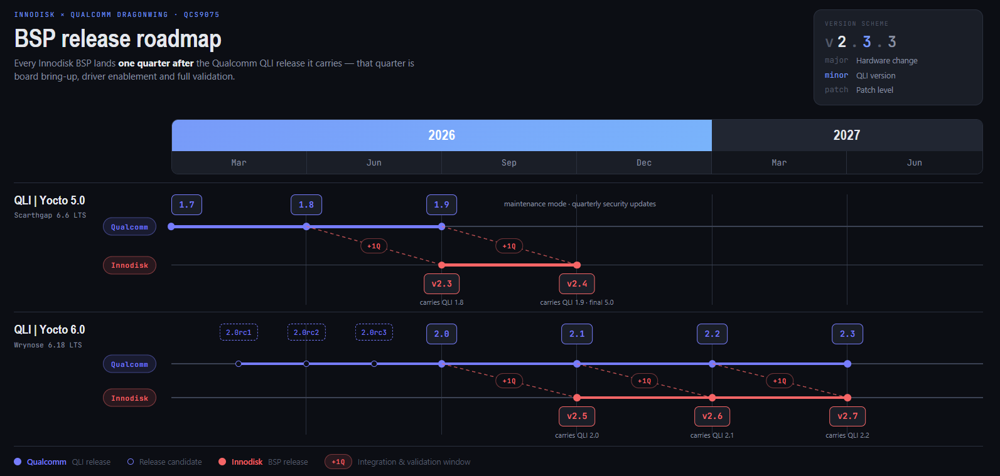

<!--
 Copyright (c) 2025 Innodisk Corp.

 This software is released under the MIT License.
 https://opensource.org/licenses/MIT
-->
# iQ Studio

  <br />
  <div align="center"></div>
  <br />

  <h1 align="center"><em><strong>Show Performance, Spark Imagination.</strong></em></h1>

  <h3 align="center">It helps users quickly understand, explore, and prototype ideas by showcasing the platform’s performance and capabilities—inspiring innovation through hands-on experience.</h3>

> [!NOTE]
> iQ-Studio is suitable for a range of products developed based on the [Innodisk Qualcomm Dragonwing SoC](https://www.innodisk.com/en/news/innodisk-unveils-ai-on-dragonwing-computing-series).

# Pick Your Path

Three common starting points. Pick the one that matches your goal today; you can always come back for another.

| 🚀 Run a demo | 🛠 Develop & customize | 📊 Evaluate the platform |
| --- | --- | --- |
| **For FAEs and evaluators.** See an AI inference demo running on the hardware in under ten minutes. | **For application developers and ML engineers.** Swap models, change inputs, or deploy your own trained model. | **For PMs and integrators.** Review measured performance on real workloads and how iQ-Studio fits the platform stack. |
| **Step 1:** [Getting Started](#getting-started)<br>**Step 2:** [30-Second Demo](#30-second-demo)<br>**Step 3:** [Applications](./tutorials/applications/README.md) | **Step 1:** [Getting Started](#getting-started)<br>**Step 2:** [SDKs](./tutorials/sdks/README.md) to customize, or [Model Deploy](./tutorials/model-deploy/README.md) to bring your own model | **Step 1:** [Benchmarks](./benchmarks/README.md)<br>**Step 2:** [Core Software Stack & Architecture](#core-software-stack--architecture) |

# Getting Started

Follow these two steps in order. Once they are done, every demo and tutorial below will run.

## Step 1. Boot your platform

Flash an image and boot the device. See the [Starting Guides](./tutorials/starting-guides/README.md); for the Q911 series, start with the [EXMP-Q911 Starting Guide](./tutorials/starting-guides/q911/README.md).

Two image options are available (see [OS Images](#os-images) for details):

- **Innodisk BSP (Yocto), recommended.** iQ-Studio is developed and validated on the Yocto-based BSP.
- **Innodisk Ubuntu image.** Earlier versions have been verified to run iQ-Studio; use it only if you need an Ubuntu environment.

## Step 2. Install iQ Studio

On the platform, run:

```bash
git clone https://github.com/InnoIPA/iQ-Studio.git
cd iQ-Studio
./install.sh
```

> Note: The latest iQ-Studio requires BSP 2.5.x (QLI 2.0). On BSP 2.3.x (QLI 1.8), run `git checkout v0.0.10` in the `iQ-Studio` directory before `./install.sh`. Tag `v0.0.10` and earlier are the releases for these platforms.

# 30-Second Demo

With the platform booted and iQ-Studio installed, two commands are enough to see a vision-language model running on a live UVC Camera feed. For the detailed walkthrough, see [iQS-VLM](./tutorials/applications/iqs-vlm/README.md).

Launch the OGenie API server:

```bash
iqs-launcher --autotag iqs-ogenie
```

Display VLM predictions on the monitor in real time:

```bash
iqs-launcher --autotag iqs-vlm-demo
```

<br />
<div align="center"></div>
<br />

For other applications and the launch commands behind them, see [Applications](./tutorials/applications/README.md).

> Note: `iqs-launcher` runs every iQ-Studio application by pulling (online) or loading (offline) the matching Docker image or IPK package. See [How to use iqs-launcher](./docs/how-to-use-iqs-launcher.md).

# Explore Documentation & Resources

iQ Studio resources are grouped into categories based on functionality:


<table>
  <col style="width: 30%">
  <col style="width: 30%">
  <col style="width: 40%">
  <thead>
    <tr>
      <th>Categories</th>
      <th>Description</th>
      <th>Topic</th>
    </tr>
  </thead>
  <tbody>
    <tr>
      <td>Starting Guides</td>
      <td>Quick-start guides for everything.</td>
      <td>
        <ul>
          <li><a href="./tutorials/starting-guides/README.md">Starting Guides Overview</a></li>
          <li><a href="./tutorials/starting-guides/q911/README.md">Q911 Quick Start Guide</a></li>
          <li><a href="./tutorials/starting-guides/flash-image/README.md">Q911 Image Flashing Guide</a></li>
          <li><a href="./tutorials/starting-guides/ota/README.md">Qualcomm OTA Guide</a></li>
        </ul>
      </td>
    </tr>
    <tr>
      <td>AVL(Approved Vendor List)</td>
      <td>Provides guidance on verifying that the driver starts correctly on the system and quickly demonstrating the validated results.</td>
      <td>
        <ul>
          <li><a href="./tutorials/avl/README.md">Approved Vendor List</a></li>
          <li><a href="./tutorials/avl/gmsl-camera/README.md">GMSL Camera</a></li>
          <li><a href="./tutorials/avl/mipi-camera/README.md">MIPI Camera</a></li>
        </ul>
      </td>
    </tr>
    <tr>
      <td>Applications</td>
      <td>Application-level examples focused on specific use cases and vertical scenarios.</td>
      <td>
        <ul>
          <li><a href="./tutorials/applications/README.md">Applications Overview</a></li>
          <li><a href="./tutorials/applications/iqs-vlm/README.md">iQS-VLM</a></li>
          <li><a href="./tutorials/applications/iqs-streampipe/README.md">iQS-Streampipe</a></li>
          <li><a href="./tutorials/applications/iqs-yolov10n/README.md">YOLOv10n INT8 Inference on GPU and NPU</a></li>
        </ul>
      </td>
    </tr>
    <tr>
      <td>Model Deploy</td>
      <td>End-to-end guides for turning trained AI models into target-ready artifacts, covering quantization, conversion, quality validation, and on-device inference.</td>
      <td>
        <ul>
          <li><a href="./tutorials/model-deploy/README.md">Model Deploy Overview</a></li>
          <li><a href="./tutorials/model-deploy/cv/yolo26/README.md">Model Deploy: How to Convert, Optimize, and Perform Inference with YOLO26 Models</a></li>
        </ul>
      </td>
    </tr>
    <tr>
      <td>SDKs</td>
      <td>Documentation and examples on how to use the SDKs effectively.</td>
      <td>
        <ul>
          <li><a href="./tutorials/sdks/README.md">SDKs Overview</a></li>
          <li><a href="./tutorials/sdks/iqs-vlm/README.md">iQS-VLM: How to Interact with the OGenie Server through Open WebUI</a></li>
          <li><a href="./tutorials/sdks/iqs-streampipe/README.md">iQS-Streampipe: How to Change the Custom Model and Video Source</a></li>
          <li><a href="./tutorials/sdks/iqs-ogenie/README.md">iQS-OGenie: Run Your Own Demo with OGenie Server</a></li>
        </ul>
      </td>
    </tr>
    <tr>
      <td>Benchmarks</td>
      <td>Reproducible performance tests for multi-stream YOLO, generic streaming pipelines, and perception models on Qualcomm QCS9075.</td>
      <td>
        <ul>
          <li><a href="./benchmarks/README.md">Benchmarks Overview</a></li>
          <li><a href="./benchmarks/innoppe/README.md">InnoPPE Benchmark</a></li>
          <li><a href="./benchmarks/iqs-streampipe/README.md">Multi-stream Inference Status</a></li>
          <li><a href="./benchmarks/perception_model/README.md">Perception AI Benchmark</a></li>
        </ul>
      </td>
    </tr>
  </tbody>
</table>

# Core Software Stack & Architecture

This section is for readers who want to understand what runs on the board and how it is built. You do not need it to run the demos above.

## Software Stack

What runs on the platform, from hardware up to the applications:

<br />
<div align="center"></div>
<br />

- **Hardware & Firmware**: [Qualcomm Dragonwing QCS9075 SoC](https://www.innodisk.com/en/products/computing/qualcomm-solution/exmp-q911) and low-level firmware.
- **Kernel Space**: Powered by [Qualcomm Linux](https://www.qualcomm.com/developer/software/qualcomm-linux), integrated with our custom [Inno DTB/drivers and Yocto environments](https://github.com/InnoIPA/meta-iQ__manifest).
- **User Space**: Seamlessly supports 3rd-party LLM SDKs, device management ([iCAP](https://www.innodisk.com/en/products/software-icap)), and inno AVL. At the very top sits the **[iQS-App layer](#explore-documentation--resources)** (VLM, Streampipe, YOLO, OGenie).

## How the Software Is Built: From Upstream to iQ-Studio

Where each piece of that stack comes from. Four layers build on one another, each on top of the layer below:

<br />
<div align="center"></div>
<br />

| Layer | What it contributes | Source |
| :--- | :--- | :--- |
| Upstream | Linux kernel LTS, Yocto Project releases, and open source components | [kernel.org](https://www.kernel.org/) and the [Yocto Project](https://www.yoctoproject.org/) |
| Qualcomm Linux (QLI) | Qualcomm Linux kernel, firmware, and SoC drivers, packaged as the QLI distribution | [Qualcomm Linux](https://www.qualcomm.com/developer/software/qualcomm-linux) |
| Innodisk BSP | The `inno meta-iq` Yocto layer, adding the inno DTB and downstream drivers on top of QLI for EXMP-Q911 and the QCS9075 iQ-9075 EVK | [InnoIPA/meta-iQ__manifest](https://github.com/InnoIPA/meta-iQ__manifest) |
| iQ-Studio | Application demos, AVL checks, benchmarks, and `iqs-launcher` compatibility handling | This repository |

The Innodisk BSP is the layer that turns a generic QLI distribution into a validated system image for Innodisk hardware. It is published as a reproducible Yocto manifest, so the exact BSP that iQ-Studio targets can be rebuilt from source.

## BSP & QLI Releases

Each QLI release line is tied to a specific Linux kernel and Yocto Project version:

| Linux Kernel | Yocto Project | Qualcomm Linux (QLI) Release |
| :--- | :--- | :--- |
| **6.6 LTS** | 4.0 Kirkstone | QLI 1.x |
| **6.6 LTS** | 5.0 Scarthgap | QLI 1.x |
| **6.18 LTS** | Wrynose (Master) | QLI 2.x |

> Note: Latest iQ-Studio targets QLI 2.x (BSP 2.5.x). QLI 1.x platforms (BSP 2.3.x) use tag `v0.0.10` or earlier.

> Note: For the full upstream timeline, including the Kirkstone track and Qualcomm's Mainline development branch, see the [Qualcomm Linux Roadmap](https://www.qualcomm.com/developer/software/qualcomm-linux).

Each Innodisk BSP release carries one QLI release and lands **one quarter after** it. That quarter is used for board bring-up, driver enablement, and full validation on Innodisk hardware.

<br />
<div align="center"></div>
<br />

The BSP version number reads as `vMAJOR.MINOR.PATCH`:

| Field | Tracks |
| :--- | :--- |
| `MAJOR` | Hardware change |
| `MINOR` | QLI version carried by the release |
| `PATCH` | Patch level |

> Note: Versions and dates beyond the current release are planned schedules and may change together with the [Qualcomm Linux Roadmap](https://www.qualcomm.com/developer/software/qualcomm-linux).

## OS Images

Besides the Yocto-based Innodisk BSP, Innodisk also provides integrated [Ubuntu images](https://ubuntu.com/download/qualcomm-iot#evaluation-kit) for development.

> Note: To keep all IO functions working correctly, use the Innodisk-provided Ubuntu image. See [InnoIPA/iQ-ubuntu__manifest](https://github.com/InnoIPA/iQ-ubuntu__manifest) for the available image versions. The official Ubuntu image from Qualcomm can boot on the platform but does not guarantee full IO support.

# In the News

Media coverage, deployments, and ecosystem case studies are collected in [In the News](./news/README.md).

# Related Repositories

iQ-Studio integrates with several sibling repositories. Each owns a specific layer of the platform stack.

- [InnoIPA/meta-iQ__manifest](https://github.com/InnoIPA/meta-iQ__manifest) — Yocto-based BSP baseline for the platform.
- [InnoIPA/iQ-Cam__manifest](https://github.com/InnoIPA/iQ-Cam__manifest) — Camera driver patches consumed by the AVL tutorials.
- [InnoIPA/iQ-ubuntu__manifest](https://github.com/InnoIPA/iQ-ubuntu__manifest) — Reference for Innodisk-provided Ubuntu image versions.
- [InnoIPA/iQ-Foundry](https://github.com/InnoIPA/iQ-Foundry) — End-to-end model quantization and on-device validation for custom models.

# Changelog

Please refer to the [Changelog](./docs/changelog.md) for all updates.

# License

This project is licensed under the MIT License. See [LICENSE](./LICENSE) for details.
