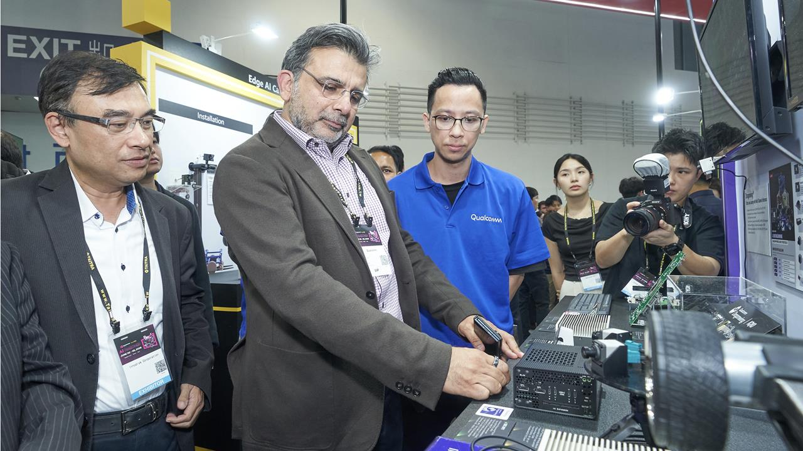
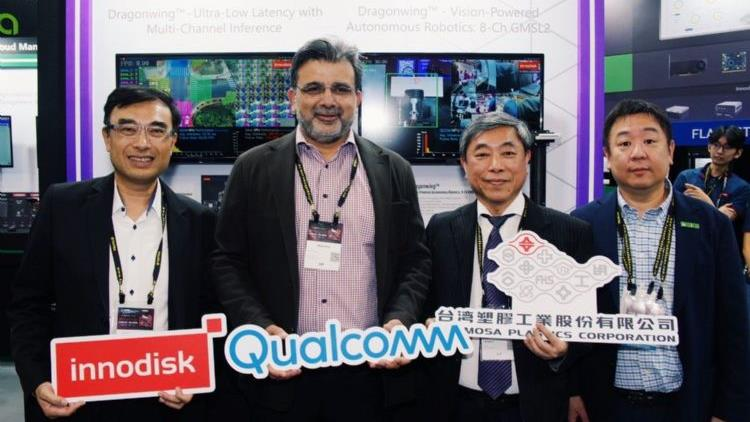
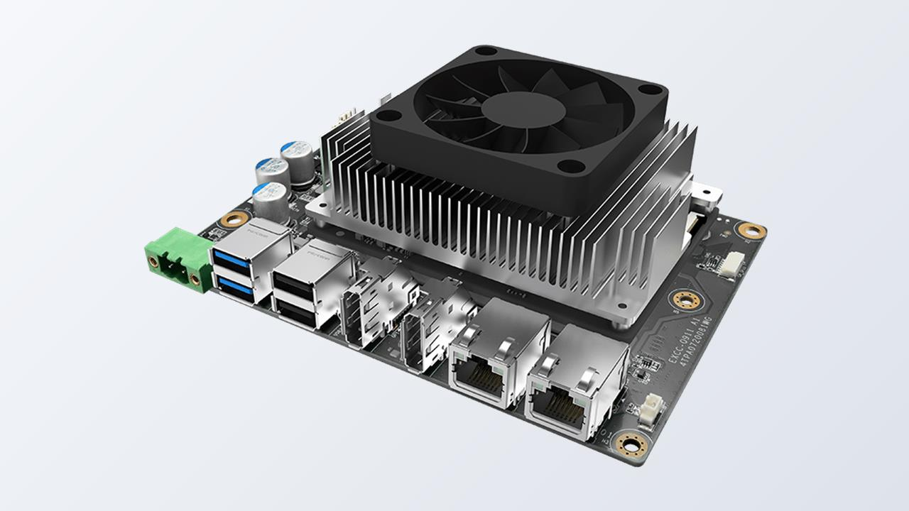
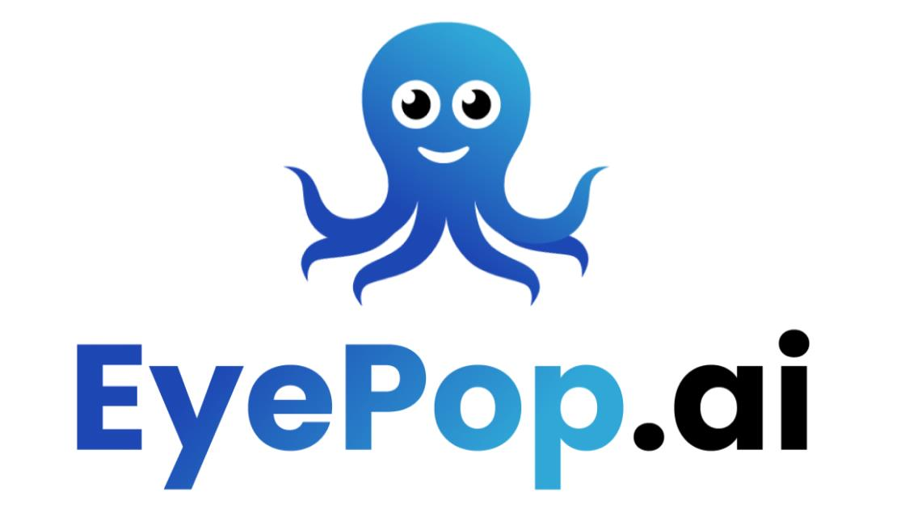

<!--
 Copyright (c) 2025 Innodisk Corp.

 This software is released under the MIT License.
 https://opensource.org/licenses/MIT
-->

# In the News

**See how Innodisk Qualcomm Dragonwing platforms, the foundation of iQ-Studio, are covered, deployed, and adopted across the industry.**

---

## About This Page

This page collects media coverage, deployment stories, and ecosystem resources about the platforms iQ-Studio runs on. It helps you answer three questions:

| If you want to know... | Go to |
| :--- | :--- |
| Where the platform is already running in the field | [Real-World Deployments](#-real-world-deployments) |
| What was announced and shown at exhibitions | [Events & Media Coverage](#-events--media-coverage) |
| How ecosystem partners use and describe the platform | [Reviews & Ecosystem Partners](#-reviews--ecosystem-partners) |

---

## 📍 Real-World Deployments

Customer and project stories where the platform is running in production or at live events.

<table>
  <tr>
    <td width="220" valign="top">
      
    </td>
    <td valign="top">
      May 1, 2026 | National Central University 
      <strong>Smart Stadium Deployment: Real-Time Environmental Monitoring and AI Analysis for the 2026 National Intercollegiate Athletic Games</strong> 
      <a href="https://2026niag.ncu.edu.tw/public/news_data.aspx?id=562">"></a>
    </td>
  </tr>
</table>

---

## 🎤 Events & Media Coverage

Exhibition reports and press articles about product launches and live demos.

<table>
  <tr>
    <td width="220" valign="top">
      
    </td>
    <td valign="top">
      June 8, 2026 | Innodisk 
      <strong>Innodisk Showcases Its Full Qualcomm Dragonwing Edge AI Lineup at COMPUTEX 2026</strong> 
      <a href="https://www.innodisk.com/en/news/innodisk-qualcomm-dragonwing-edge-ai-computex-2026">"></a>
    </td>
  </tr>
  <tr>
    <td width="220" valign="top">
      
    </td>
    <td valign="top">
      June 4, 2026 | DIGITIMES 
      <strong>Innodisk Partners with Qualcomm and Formosa Plastics to Launch an AI Industrial Safety Visual Solution</strong> 
      <a href="https://www.digitimes.com.tw/tech/dt/n/shwnws.asp?id=0000757480_JWT5HXC07NK7DZ1JHX78H">"></a>
    </td>
  </tr>
  <tr>
    <td width="220" valign="top">
      
    </td>
    <td valign="top">
      March 23, 2026 | StorageNewsletter 
      <strong>Embedded World 2026: Innodisk Showcases an Integrated Edge AI Portfolio for Industrial Deployment</strong> 
      <a href="https://www.storagenewsletter.com/2026/03/23/embedded-world-2026-innodisk-showcases-integrated-edge-ai-portfolio-for-industrial-deployment/">"></a>
    </td>
  </tr>
</table>

---

## 🤝 Reviews & Ecosystem Partners

Case studies and technical documentation from ecosystem partners such as Qualcomm, Edge Impulse, and EyePop.ai.

<table>
  <tr>
    <td width="220" valign="top">
      
    </td>
    <td valign="top">
      -- | Qualcomm Partner Network 
      <strong>Why Innodisk Chose the Qualcomm Dragonwing™ IQ-9075 Processor for Real-time Multi-Channel Video Inferencing and Edge AI</strong> 
      <a href="https://www.qualcomm.com/support/partner/blog/innodisk-iq9">"></a>
    </td>
  </tr>
  <tr>
    <td width="220" valign="top">
      
    </td>
    <td valign="top">
      -- | Edge Impulse Documentation 
      <strong>Deploy Accelerated Edge Impulse Models on Innodisk Dragonwing Platforms: Ubuntu Setup and Qualcomm Dependencies</strong> 
      <a href="https://docs.edgeimpulse.com/hardware/boards/innodisk-exec-q911">"></a>
    </td>
  </tr>
  <tr>
    <td width="220" valign="top">
      
    </td>
    <td valign="top">
      -- | EyePop.ai 
      <strong>Real-Time Computer Vision at the Edge: EyePop.ai on Innodisk Dragonwing Platforms</strong> 
      <a href="https://www.eyepop.ai/deployments/dragonwing-edge-ai-eyepop-ai-on-innodisk">"></a>
    </td>
  </tr>
</table>

---

## Keep Exploring

- Run a demo on your device: [Applications](../tutorials/applications/README.md)
- See measured results: [Benchmarks](../benchmarks/README.md)
- Boot your hardware first: [Starting Guides](../tutorials/starting-guides/README.md)

<!--
Maintainer guide: how to add an entry

1. Pick the section that matches the article type, then copy one <tr>...</tr> block in it.
2. Thumbnail: save the image as ./fig/<name>.jpg (16:9, about 1280x720) and point src to it.
3. Date | Source: use "Month D, YYYY | Publisher". Use "-- | Publisher" if the article shows no date.
4. Title: edit the text inside <strong>.
5. Link: update both href values (thumbnail and Read More) to the same URL.
6. Keep newest entries at the top of each section.
-->
