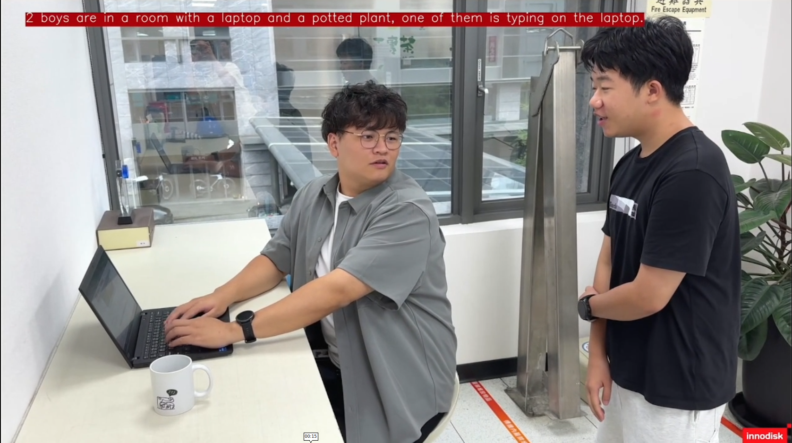

<!--
 Copyright (c) 2025 Innodisk Corp.
 
 This software is released under the MIT License.
 https://opensource.org/licenses/MIT
-->

# iQS-VLM

This demo showcases real-time inference using the vision-language model
**LLaVA-1.5-7B** on the platform with a live video stream from a UVC camera. It
utilizes `OGenie`, our API server that handles LLM/VLM inference requests, along
with `iq-VLM-DEMO`, which captures images from UVC cameras and displays the VLM
results on a monitor.


# How to Deploy

## Supported Versions

Pick the iQ-Studio version that matches your platform:

| Your platform | iQ-Studio version |
| :--- | :--- |
| BSP 2.5.x (QLI 2.0) | Latest (`main`) |
| BSP 2.3.x (QLI 1.8) | Tag `v0.0.10` or earlier |

- **Check BSP:** `cat /etc/innodisk/BSP-version`
- **Check QLI:** `uname -a`, then look for the `qli-<version>` field.

> Note: On BSP 2.3.x, run `git checkout v0.0.10` in the `iQ-Studio` directory before `./install.sh`. To return to the latest version, run `git checkout main`.

## What do you need?
1. At least 10 GB of free disk space
2. A monitor
3. A UVC camera
    - 1080p/30fps (1920x1080 pixels)
    - MJPEG compression format
    > Note: We have tried this demo with this [USB camera](https://www.innodisk.com/en/products/camera/usb-20/ev2u-ssm1-rlcf).

Please plug both devices—the UVC camera and the monitor—into the platform.

## How to start?

```bash
git clone https://github.com/InnoIPA/iQ-Studio.git
cd iQ-Studio
./install.sh
```

# How to Use

The demo consists of two separate services, `OGenie` and `iqs-vlm-demo`. Each
runs in its own terminal, so please open two terminals and run one command in
each.

> **Important:** Make sure the `OGenie` server is up and running before you
> start `iqs-vlm-demo`.

## Terminal 1: Launch `OGenie` API server

```bash
iqs-launcher --autotag iqs-ogenie
```

After starting `OGenie` server,  its URLs will be printed. 

```
OGenie Server can be reached by the following URLs:
http://127.0.0.1:22434
http://192.168.3.206:22434
http://172.17.0.1:22434
```

## Terminal 2: Real-Time Display of VLM Predictions on the Monitor

```bash
iqs-launcher --autotag iqs-vlm-demo
```

Running this command will open a window showing live video from the UVC camera,
with the VLM response overlaid on the video. Press `q` to close the
window.



# LLaVA-1.5-7B Performance

- Tokens per Second: 11

# How to Interact with the OGenie Server through Open WebUI

For advanced features and usage examples, visit this [page](../../sdks/iqs-vlm/README.md) to learn more.
