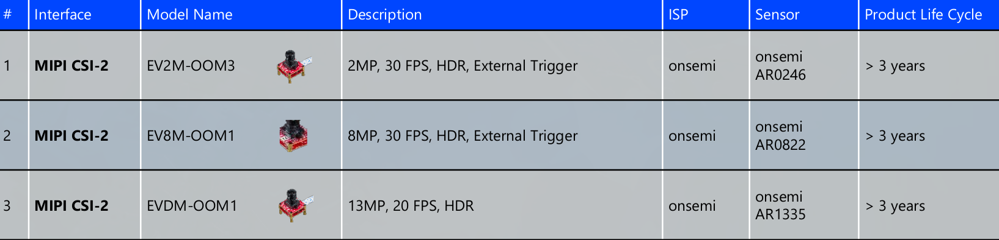
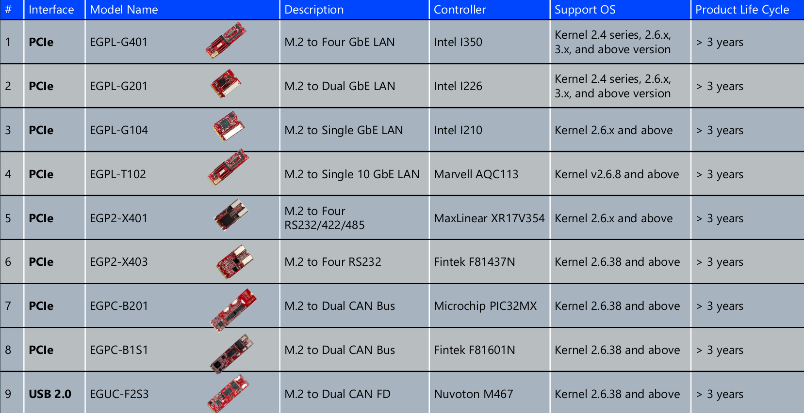

<!--
 Copyright (c) 2025 Innodisk Corp.
 
 This software is released under the MIT License.
 https://opensource.org/licenses/MIT
-->

# Approved Vendor List
The following figures show the MIPI camera and EP provided by Innodisk based on the Qualcomm platform, all of which are included in the Approved Vendor List.

## Support MIPI CSI-2 Camera List

## Supported Embedded Peripheral Modules
