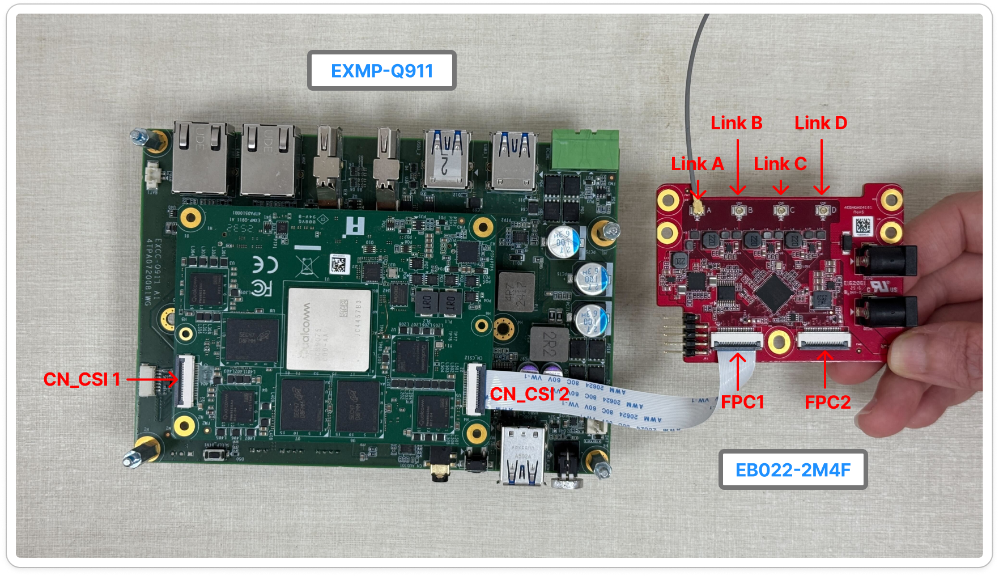
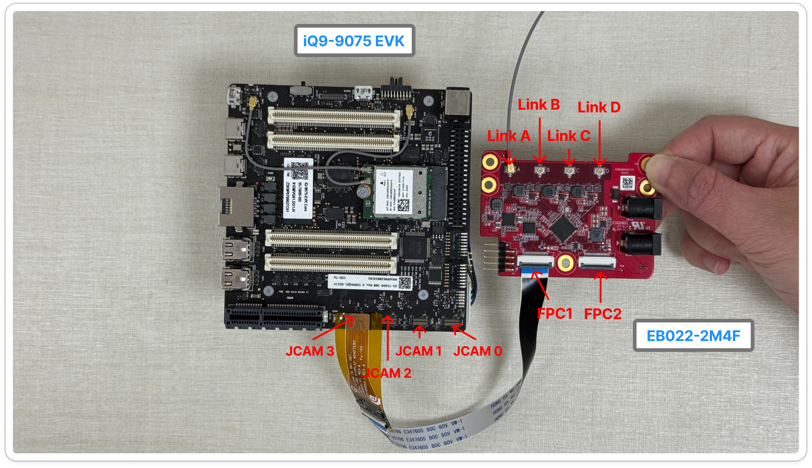
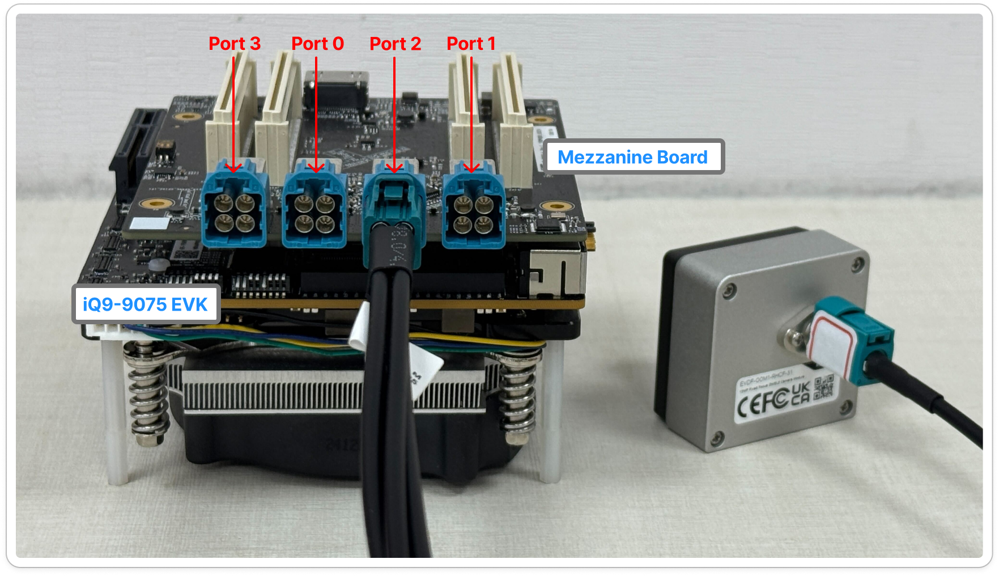
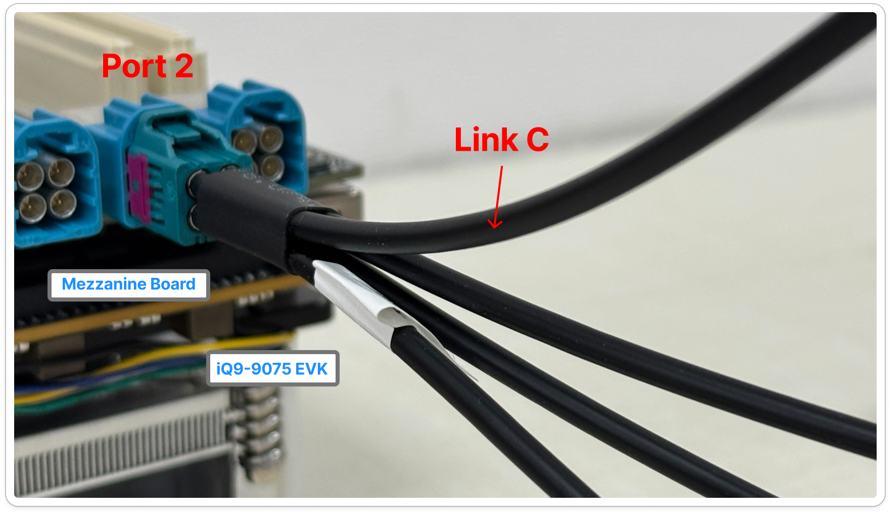
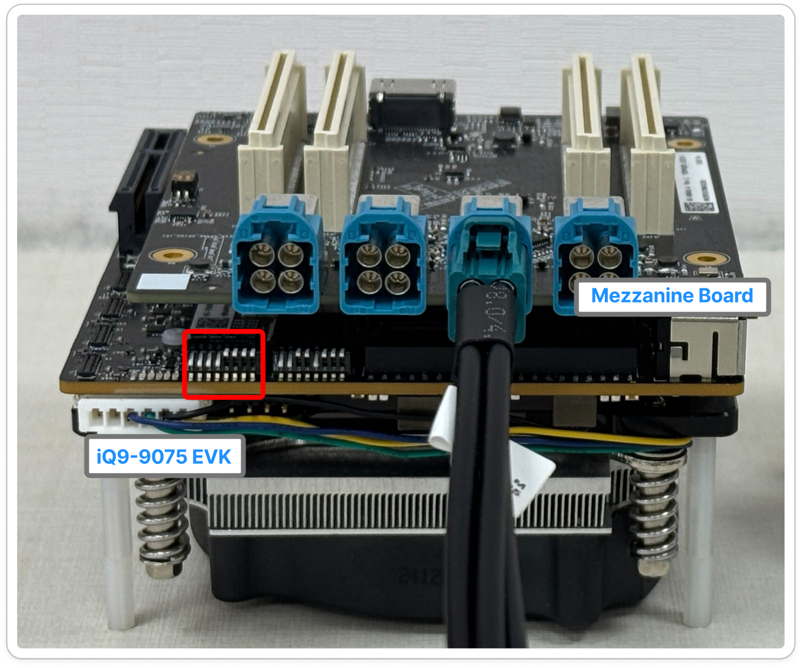

# GMSL Camera

GMSL provides a highly flexible interface for camera installation. 

Unlike MIPI CSI-2, which typically supports only short-range connections of several tens of centimeters, GMSL enables long-distance video transmission up to 10 -15 meters over a single coaxial cable. This allows cameras to be placed several meters away from the platform while maintaining low latency and high reliability.

GMSL is widely used in autonomous driving, industrial mobile equipment, 360° surround-view stitching, and multi-channel real-time AI recognition applications.

> 💡 **Tip:** You check out the **[iQS-Streampipe](../../../applications/iqs-streampipe/README.md)** to see the how to run the multi-stream on our platform.

## Supported Components

- Camera: [EVDF-OOM1](https://www.innodisk.com/en/products/camera/gmsl2/evdf-oom1-rhcf)
- Adapter Board: [EB022-2M4F](https://www.innodisk.com/en/products/camera/adapter-board/eb022-2m4f)
    > Please use 12V Power Adapter
- Evaluation Kit: [IQ-9075 EVK](https://www.qualcomm.com/developer/hardware/qualcomm-iq-9075-evaluation-kit-evk)
- GMSL Mezzanine Board: [Mezzanine Board](https://docs.qualcomm.com/bundle/resource/topics/80-70020-17A/connect-camera-sensor-hardware.html)
- IQ-9075 EVK OS: [Ubuntu 24.04](https://ubuntu.com/download/qualcomm-iot)

## Camera Metrix

| Module | Support Platform | Adapter Board | Support OS | CN_CSI1  | CN_CSI2 | Resolution, Frame Rate |
| --- | --- | --- | --- | --- | --- | --- |
| EVDF-OOM1 | EXMP-Q911 | EB022-2M4F | Yocto linux 1.5, Ubuntu 24.04 | ☑️ | ✅ | 1920x1080, 30 FPS |

☑️ Comming soon ✅ Support ❌ Not support



Connect the GMSL Camera to EXMP-Q911 and EB022-2M4F GMSL adapter board, follow the steps below:

1. Use a 22-pin to 22-pin MIPI cable (A-B style). Connect CN_CSIx to the corresponding FPC1 header. The cable type is required for proper CSI lane alignment.
2. Use Link A to connect the GMSL camera. Only Link A is supported, and the adapter board can operate with one MIPI sensor at a time.
3. Power on the EB022-2M4F first, and then power on the EXMP-Q911.

<br />
<br />

| Module | Support Platform | Adapter Board | Support OS | JCAM0 | JCAM1 | JCAM2 | JCAM3 | Resolution, Frame Rate |
| --- | --- | --- | --- | --- | --- | --- | --- | --- |
| EVDF-OOM1 | iQ-9075 EVK | EB022-2M4F | Yocto linux 1.5 | ❌ | ❌ | ✅ | ✅ | 1920x1080, 30 FPS |
| EVDF-OOM1 | iQ-9075 EVK | EB022-2M4F | Ubuntu 24.04 | ✅ | ✅ | ✅ | ✅ | 1920x1080, 30 FPS |

☑️ Comming soon ✅ Support ❌ Not support



Connect the camera to the iQ-9075 EVK and EB022-2M4F GMSL adapter board, follow the steps below:

1. Use the 22-30 pin Adapter to connect the 22-pin to 22-pin MIPI cable (A-A style). 
2. Connect CN_CSIx to the corresponding FPC1 header. This cable type is required for proper CSI lane alignment.
3. Use Link A to connect the GMSL camera. Only Link A is supported, and the adapter board can operate with one MIPI sensor at a time.
4. Power on the EB022-2M4F first, and then power on the iQ-9075 EVK.

<br />
<br />

| Module | Adapter Board | Support OS | Port0 | Port1 | Port2 | Port3 | Resolution, Frame Rate |
| --- | --- | --- | --- | --- | --- | --- | --- |
| EVDF-OOM1 | Mezzanine Board  | `Yocto` `Ubuntu 24.04` | ❌ | ❌ | ✅ | ❌ | 1920x1080, 30 FPS |

☑️ Comming soon ✅ Support ❌ Not support



Connect the iQ-9075 EVK to the mezzanine board, follow the steps below:

1. Connect the Mezzanine board on iQ9-9075 EVK
2. Use Link C to connect the GMSL Camera.Only Link C  is supported, and the adapter board can operate with one MIPI sensor at a time.

    <div align="left"></div>

3. Set the DIP switch according to the configuration shown in the image below. Please refer to [here](https://docs.qualcomm.com/bundle/resource/topics/80-70020-17A/connect-camera-sensor-hardware.html) for more DIP switch detail.
    
    <div align="left"></div>
    
4. Power on  iQ9-9075 EVK.

## How to Install the Driver for GMSL Camera

1. Copy the `.ipk`  or `.deb` to the target platform
    
    ```bash
    $ scp release/ev2m_oom3.ipk <target> # or ev2m_oom3.deb
    ```
    
2. Install and reboot
    - Yocto Linux 1.5
        1. Install `.ipk`
            
            ```
            $ mount -o rw,remount /usr
            $ opkg --nodeps install ./ev2m_oom3.ipk --force-reinstall
            $ reboot
            ```
            
    - Ubuntu 24.04
        1. Please install the package before install the `.deb` 
            
            ```
            sudo apt update
            sudo apt-add-repository -s ppa:ubuntu-qcom-iot/qcom-ppa
            sudo apt update && sudo apt upgrade
            sudo apt install gstreamer1.0-qcom-sample-apps
            ```
            
        2. Install `.deb`
            
            ```
            $ sudo dpkg -i ../ev2m_oom3.deb
            $ sudo cp -ar /usr/lib/qcs9100/aarch64-linux-gnu/libcommonchiutils.so* /usr/lib/
            $ sudo reboot
            ```
            

## How to Open the GMSL Camera

If the camera is properly connected to the platform and the required drivers are correctly installed, you can use the following GStreamer command to run the camera.

1. If you don’t have the file `/var/cache/camera/camxoverridesettings.txt`, please create one and add the following line inside it:
    
    ```bash
    HMSMaxDelayedJobCount=8
    ```
2. Run the following command
    ```bash
        $ gst-launch-1.0 -e qtiqmmfsrc name=camsrc camera=0 ! \
        'video/x-raw,width=1920,height=1080,framerate=30/1' ! \
        videoconvert ! v4l2h264enc !  h264parse ! mp4mux ! filesink location=test.mp4
    ```

    