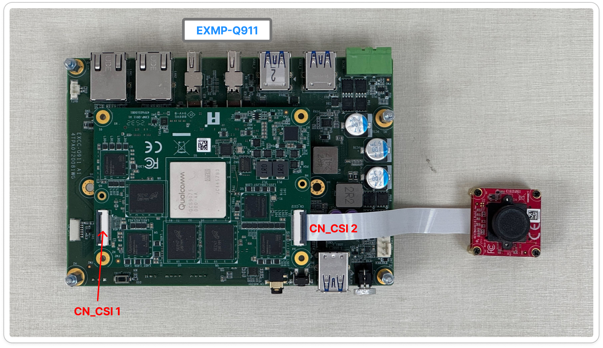
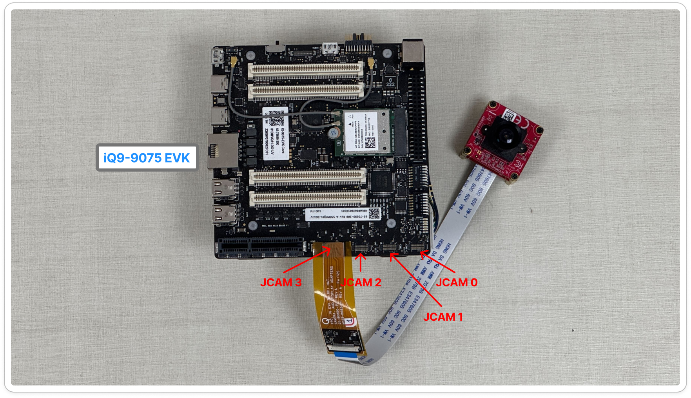

# MIPI Camera

MIPI CSI-2 is a widely adopted camera interface standard designed for high-bandwidth, low-power, and low-latency transmission between image sensors and processing SoCs.

It supports multi-gigabit throughput per lane, enabling high-resolution and high-frame-rate video pipelines for modern imaging applications.

With its mature ecosystem and broad sensor compatibility, MIPI CSI-2 is commonly used in smartphones, tablets, embedded vision modules, industrial automation, robotics, medical imaging systems, and AI edge devices.

> 💡 **Tip:** You check out the **[iQS-Streampipe](../../../applications/iqs-streampipe/README.md)** to see the how to run the multi-stream on our platform.

## Supported Components

- Camera: [EVDM-OOM1](https://www.innodisk.com/en/products/camera/mipi-csi-2/evdm-oom1-rhcf)
- Camera: EVDM-OOM3
- Evaluation Kit: [IQ-9075 EVK](https://www.qualcomm.com/developer/hardware/qualcomm-iq-9075-evaluation-kit-evk)
- IQ-9075 EVK OS: [Ubuntu 24.04](https://ubuntu.com/download/qualcomm-iot)

## Camera Metrix
| Module | Support Platform | Support OS | CN_CSI1 | CN_CSI2 | Resolution, Frame Rate |
| --- | --- | --- | --- | --- | --- |
| EV2M-OOM3 | EXMP-Q911 | Yocto linux 1.5, Ubuntu 24.04 | ☑️ | ✅ | 1920x1080, 30 FPS |
| EVDM-OOM1 | EXMP-Q911 | Yocto linux 1.5, Ubuntu 24.04 | ☑️ | ✅ | 1920x1080, 30 FPS |

☑️ Comming soon ✅ Support ❌ Not support



Connect the Camera to the EXMP-Q911, follow the steps below:

1. Use a 22-pin to 22-pin MIPI cable (A-B style). Connect CN_CSIx to the camera. The cable type is required for proper CSI lane alignment.
2. Only **one MIPI sensor** can be used at a time.
3. Power on the EXMP-Q911.

<br />
<br />

| Module | Support Platform | Support OS | JCAM0 | JCAM1 | JCAM2 | JCAM3 | Resolution, Frame Rate |
| --- | --- | --- | --- | --- | --- | --- | --- |
| EVDM-OOM1 | iQ-9075 EVK | Yocto linux 1.5 | ☑️ | ☑️ | ✅ | ✅ | 1920x1080, 30 FPS |
| EVDM-OOM1 | iQ-9075 EVK | Ubuntu 24.04 | ✅ | ✅ | ✅ | ✅ | 1920x1080, 30 FPS |
| EV2M-OOM3 | iQ-9075 EVK | Yocto linux 1.5 | ☑️ | ☑️ | ✅ | ✅ | 1920x1080, 30 FPS |
| EV2M-OOM3 | iQ-9075 EVK | Ubuntu 24.04 | ✅ | ✅ | ✅ | ✅ | 1920x1080, 30 FPS |

☑️ Comming soon ✅ Support ❌ Not support



Connect the Camera to the iQ-9075 EVK, follow the steps below:

1. Use the 22-30 pin Adapter to connect the 22-pin to 22-pin MIPI cable (A-A style). 
2. Connect CN_CSIx to the camera. This cable type is required for proper CSI lane alignment.
3. Only **one MIPI sensor** can be used at a time.
4. Power on the iQ-9075 EVK.

## How to Install the Driver for MIPI Camera

1. Copy the `.ipk`  or `.deb` to the target platform
    
    ```bash
    $ scp release/ev2m_oom3.ipk <target> # or ev2m_oom3.deb
    ```
    
2. Install and reboot
    - Yocto Linux 1.5
        1. Install `.ipk`
            
            ```
            $ mount -o rw,remount /usr
            $ opkg --nodeps install ./ev2m_oom3.ipk --force-reinstall
            $ reboot
            ```
            
    - Ubuntu 24.04
        1. Please install the package before install the `.deb` 
            
            ```
            sudo apt update
            sudo apt-add-repository -s ppa:ubuntu-qcom-iot/qcom-ppa
            sudo apt update && sudo apt upgrade
            sudo apt install gstreamer1.0-qcom-sample-apps
            ```
            
        2. Install `.deb`
            
            ```bash
            $ sudo dpkg -i ../ev2m_oom3.deb
            $ sudo cp -ar /usr/lib/qcs9100/aarch64-linux-gnu/libcommonchiutils.so* /usr/lib/
            $ sudo reboot
            ```
            

### How to Open the MIPI Camera

If the camera is properly connected to the platform and the required drivers are correctly installed, you can use the following GStreamer command to run the camera.

1. Stop the `cam-server` first.
    
    ```bash
        pkill cam-server
    ```
    > 🔔️ **Known Issue**: The cam-server must be restarted once after each system reboot. You only need to restart it again if the system is rebooted.

2. Run the following command.
    
    ```bash
    gst-launch-1.0 -e qtiqmmfsrc name=camsrc camera=0 ! \
    'video/x-raw,width=1920,height=1080,framerate=30/1' ! \
    videoconvert ! v4l2h264enc !  h264parse ! mp4mux ! filesink location=test.mp4
    ```

    
    