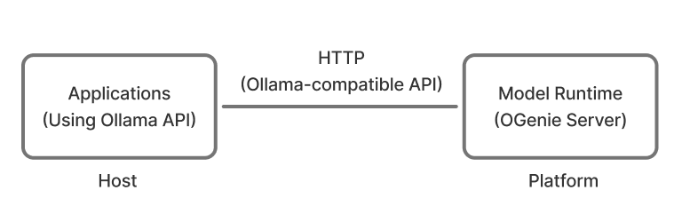

<!--
 Copyright (c) 2025 Innodisk Corp.
 
 This software is released under the MIT License.
 https://opensource.org/licenses/MIT
-->

# Run Your Own Demo with OGenie

This section shows you how to integrate and run your own demo using OGenie. You’ll learn how to set up the environment, use example code for both LLM and VLM chat. Currently, we only support LLM and VLM models officially released by [Qualcomm](https://aihub.qualcomm.com/models).

<div align="center"></div>

> 💡 **Tip:** Please check out the **[iQS-VLM](../../applications/iqs-vlm/README.md)** to see how OGenie is used in real-time applications. Or see how to use OpenWebUI to interact with OGenie in the **[iQS-VLM SDK](../iqs-vlm/README.md)**.


## OGenie SDK

OGenie SDK provides an HTTP server that implements the Ollama-compatible API, allowing developers to use the official Ollama services (Python SDK / HTTP interface) to interact with OGenie. The inference runtime is provided by OGenie, users do NOT need Ollama’s model runner or server.

Currently, the following [APIs](https://ollama.readthedocs.io/en/api/) are supported:

- `/api/tags`
- `/api/chat`

### Start the OGenie Server on the Platform

1. Before getting started, make sure OGenie is running on the target platform. You can start it using the following command.
    
    ```shell
    git clone https://github.com/InnoIPA/iQ-Studio.git
    cd iQ-Studio
    ./install.sh
    ```
    
    ```bash
    $ iqs-launcher --autotag iqs-ogenie
    ```
    
    After starting the OGenie server, its URLs will be printed.
    ```bash
    # OGenie Server can be reached by the following URLs:
    http://127.0.0.1:22434
    http://192.168.3.206:22434
    http://172.17.0.1:22434
    ```

### Run the Example Code on the Host to Interact with OGenie

1. Prepare the Ollama environment on the host machine by installing Ollama with the following command: 
    
    ```bash
    curl -fsSL https://ollama.com/install.sh | sh
    ```
    
2. Before running the example, set the environment variable by executing the following command:
    
    ```bash
    # Set the environment variable for your OGenie server
    # Replace <OGenie-server-IP:port> with your actual server address
    $ export OLLAMA_HOST=http://<OGenie-server-IP:port>
    
    # Example:
    $ export OLLAMA_HOST=http://192.168.3.223:22434
    ```
    
3. (Optional) The following API returns all models currently available on the OGenie server.
    
    ```bash
    $ python3 -c "import ollama; print(ollama.list())"
    
    # The model name appears under the 'model' key, for example:
    # 'model': 'llava2-7b:latest'

    ```
    
4. To use Ollama in Python, create a file called `example.py` and copy the example code into it.
   - **LLM chat example**
        
        ```python
        import ollama
        
        response = ollama.chat(
            model='llama3_8b:latest',
            messages=[
                {'role': 'system', 'content': 'You are a helpful AI assistant.'},
                {'role': 'user', 'content': 'What is France\'s capital?'}
            ],
            stream=True
        )
        
        for content in response:
            print(content['message']['content'], end='', flush=True)
        
        # Example output from llama3_8b:latest:
        # Bonjour! The capital of France is Paris.
        ```
        
   - **VLM chat example**
    
      ```python
        import ollama

        response = ollama.chat(
            model='llava2-7b:latest',
            messages=[
            {
                    'role': 'system',
                    'content': 'You are a helpful AI assistant.'
            },
            {
                    'role': 'user',
                    'content': 'What do you see in the picture',
                    'images': ['test.png']
            }
            ],
            stream=True
        )

        for content in response:
            print(content['message']['content'], end='', flush=True)

        # Example output from llava2-7b:latest:
        # In the image, there are two men standing in a room, both using laptops. 
        # One man is positioned on the left side of the room, while the other is on the right side. 
        # Both men appear focused on their laptops, possibly working or studying together.
        #
        # The room features a dining table in the background, with a potted plant near the right side. 
        # Two cups are on the table — one closer to the left man and the other closer to the right man. 
        # There is also a bottle near the left man and a cell phone placed on the table.

      
      ```
