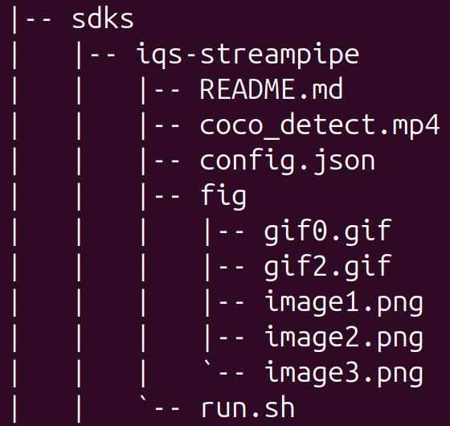
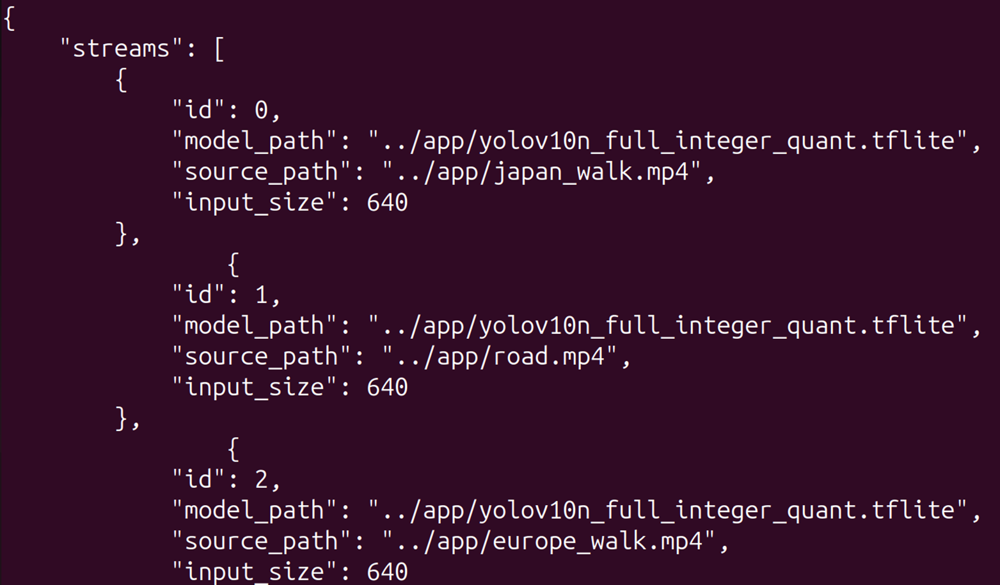
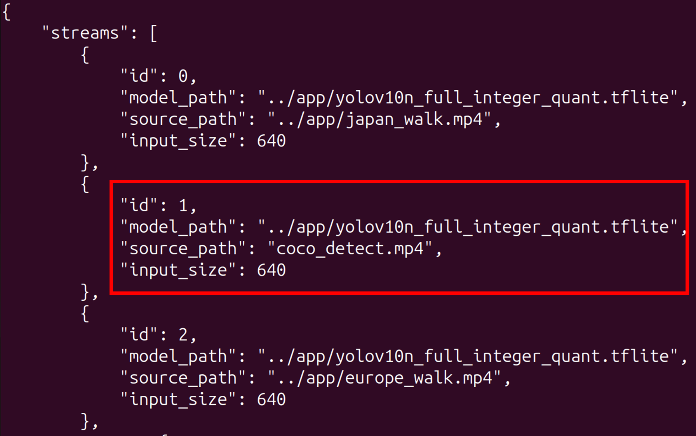

<!--
 Copyright (c) 2025 Innodisk Corp.
 
 This software is released under the MIT License.
 https://opensource.org/licenses/MIT
-->

# iQS-Streampipe

Please refer to the `tutorial/applications/iqs-streampipe`to learn how to run [iqs-streampipe](../../applications/iqs-streampipe/README.md).

In this section, we describe how to use custom models and video inputs with iqs-streampipe. 

## How to modify the content displayed, please refer to the `config.json` file in the current directory.


1. Navigate to the iqs-streampipe directory.and check the file in your current directory.
    
    ```bash
    cd tutorials/integrations/iqs-streampipe/
    ls
    ```
    
    
    
2. Open the `config.json` file in the current directory
    
    To open and edit the `config.json` file.(default parameter)
    
    ```bash
    vim config.json
    ```
    <br />
    <div align="center"></div>
    <br />
    
3. Modify `config.json`. We have changed the video under `id: 1` to `coco_detect.mp4`.You may replace coco_detect.mp4 with your own video file if desired.
   
    ⚠ NOTE : This config is not the default config in the Docker container.

    Enter the Relativate Path into the config file.

    <br />
    <div align="center"></div>
    <br />
    
4. After you finish modifying.
    
    save and close the `config.json`.
    
    ```bash
    :wq
    ```
    
5. Run the iqs-launcher 

    ⚠ NOTE : You must add the `--other "-c config.json"` option to change the videos..
    
    ```bash
    iqs-launcher --autotag iqs-streampipe --other "-c config.json"
    ```
    
6. Change the display of ID 1 to the specified view.

    <br />
    <div align="center"></div>
    <br />

## How to use a UVC camera to capture video frames for real-time prediction.

- When a UVC camera's USB plug is connected to the platform's USB port, the video prediction will automatically switch to and display the real-time prediction results from the UVC camera feed.
- When multiple cameras are plugged in, the results will be replaced based on channels, starting with channel 0, then channel 1, and so on.

<br />
<div align="center"></div>
<br />

> Notice: Due to limited bandwidth, using more than 3 UVC cameras will cause video lag.if you use more than 4 camera will cause the unexpected bug.
