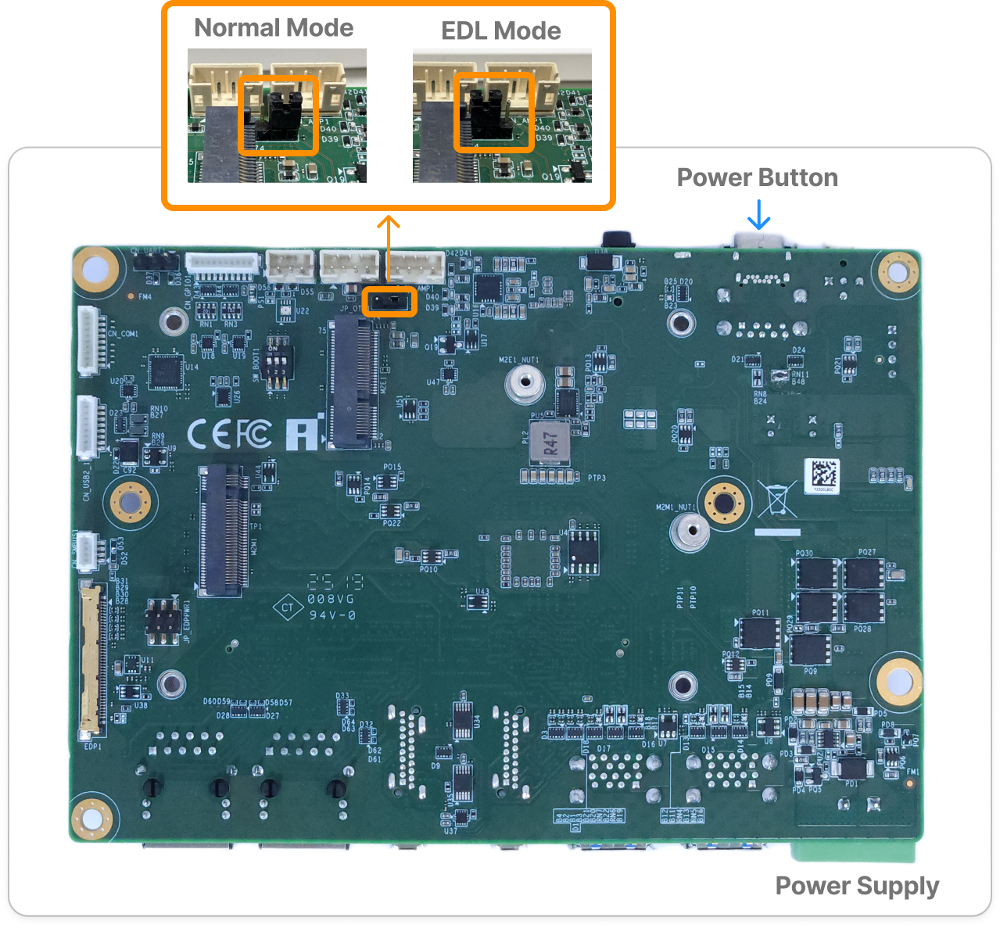
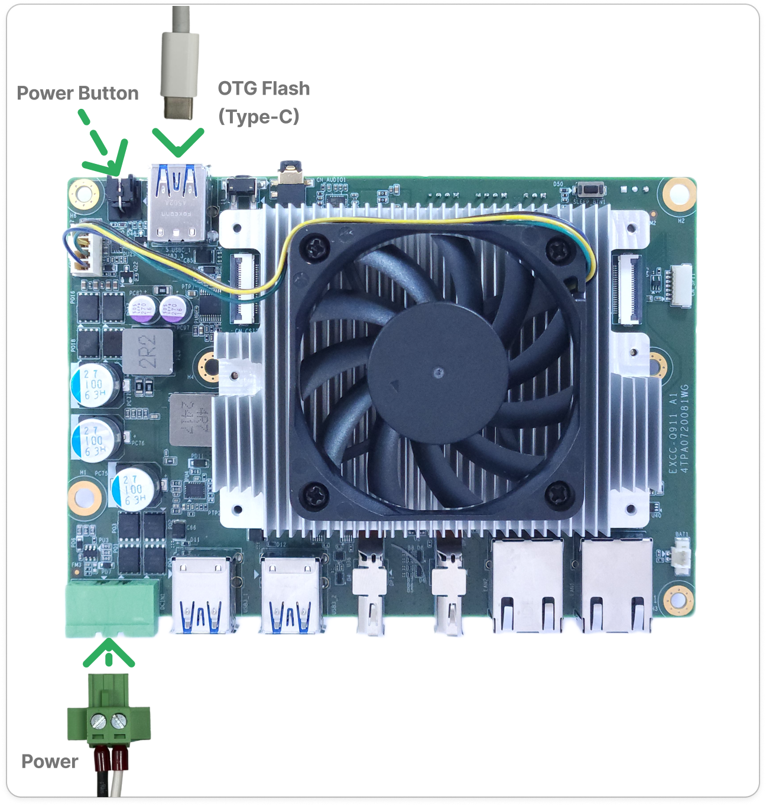
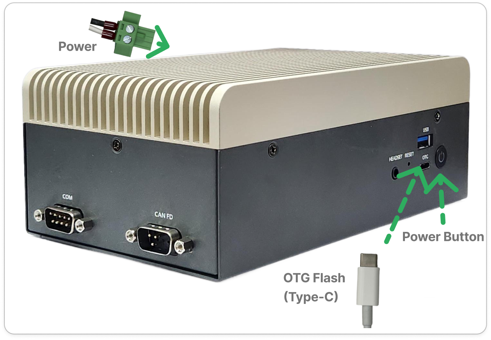
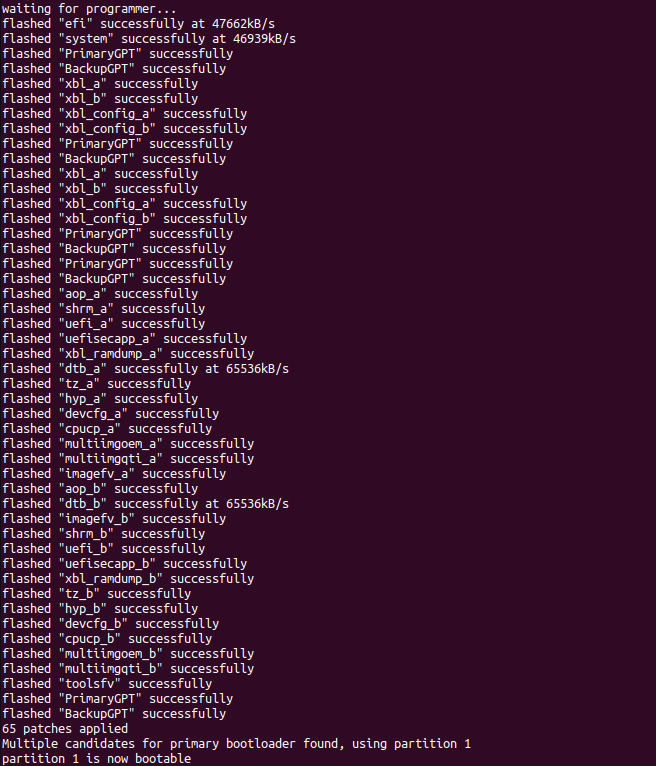

# Q911 Image Flashing Guide

This guide provides instructions for flashing or updating the system image on the Q911 platforms, including EXEC-Q911 and APEX-A100.

The steps below ensure that your flashing process completes successfully, as the hardware must be switched to the correct mode before flashing.


## Step 1: Prepare the Host Environment and Target Connection

When you need to update the BSP, recover a corrupted system. You can directly refer to [Qualcomm’s instructions for prerequisites](https://docs.qualcomm.com/doc/80-90441-252/topic/Integrate-and-flash-software.html?product=1601111740076074&facet=Ubuntu%20quickstart#prerequisites) to verify the prerequisites. 

For the initial setup, if you are using Ubuntu as the host system, you must configure the USB-to-Type-C connection on the host according to Qualcomm’s official guide.
Please follow Steps 1–2 in [Flash Dragonwing IQ-9075 EVK Integrated Image on an Ubuntu Host](https://docs.qualcomm.com/doc/80-90441-252/topic/Integrate-and-flash-software.html?product=1601111740076074&facet=Ubuntu%20quickstart#panel-0-0-0tab$flash-dragonwing-iq-9075-evk-integrated-image-on-ubuntu-host).

## Step 2: Set the Board to EDL Mode

After completing the required preparations, please ensure that the jumper on the bottom side of the board is set to `EDL mode`.

   <p align="center">
    
  </p>


## Step 3: Power on

Connect the power supply and press the power button to power on. 


  <div align="center">
    <table>
      <tr>
        <td align="center"  width="50%" valign="bottom">
          
        </td>
        <td align="center"  width="50%" valign="bottom">
          
        </td>
      </tr>
      <tr>
        <td align="center">EXEC-Q911</td>
        <td align="center">APEX-A100</td>
      </tr>
    </table>
  </div>


## Step 4: Flash the Image

1. After verifying all prerequisites, you can extract the package on the host and run the flashing command.

    ```bash
        unzip image.zip
        cd image
    ```
    ```bash

    # You will see a list of files similar to the ones shown below. 
    # Only a portion is displayed here — your folder will contain more files.
    .
    ├── aop.mbn
    ├── cpucp.elf
    ├── devcfg_iot.mbn
    ├── dtb.bin
    ├── el2-dtb.bin
    ├── gpt_backup0.bin
    ├── gpt_backup1.bin
        .
        .
        .
    ```
2. Please refer to the official Qualcomm documentation for the exact command usage, and follow Step 3 in “Flash Dragonwing IQ-9075 EVK Integrated Image on an Ubuntu Host”: [Qualcomm Documentation](https://docs.qualcomm.com/doc/80-90441-252/topic/Integrate-and-flash-software.html?product=1601111740076074&facet=Ubuntu%20quickstart#panel-0-0-0tab$flash-dragonwing-iq-9075-evk-integrated-image-on-ubuntu-host).

If the flashing process completes successfully, you will see output similar to the following.
    <p align="center">
    
    </p>


## Step 5: Power Off and Set the Board to Normal Mode

Please ensure that the jumper on the bottom side of the board is set to `Normal mode`.

   <p align="center">
    
  </p>

## Step 6: Boot into the System

Each operating system has different default login credentials:

- Yocto Linux

  ```bash
    Username: root
    Password: oelinux123
  ```
- Ubuntu (You will be asked to set a new password after logging in for the first time.)
  ```bash
    Username: ubuntu
    Password: ubuntu
  ```
    - For Ubuntu, the network configuration will not be enabled until the iq-ubuntu.deb package is installed. Please follow the steps below to complete the installation: 
    
    1. Use a USB storage device to copy the `iq-ubuntu.deb` to the system. The `iq-ubuntu.deb` package is included in the BSP’s image folder.
    2. Install the package using the command: `sudo apt install </path/to/iq-ubuntu.deb>`
    3. Reboot the system. Network functionality will be available after the restart.

For additional usage instructions, please refer to the [Q911 Quick Start Guide](../q911/README.md).