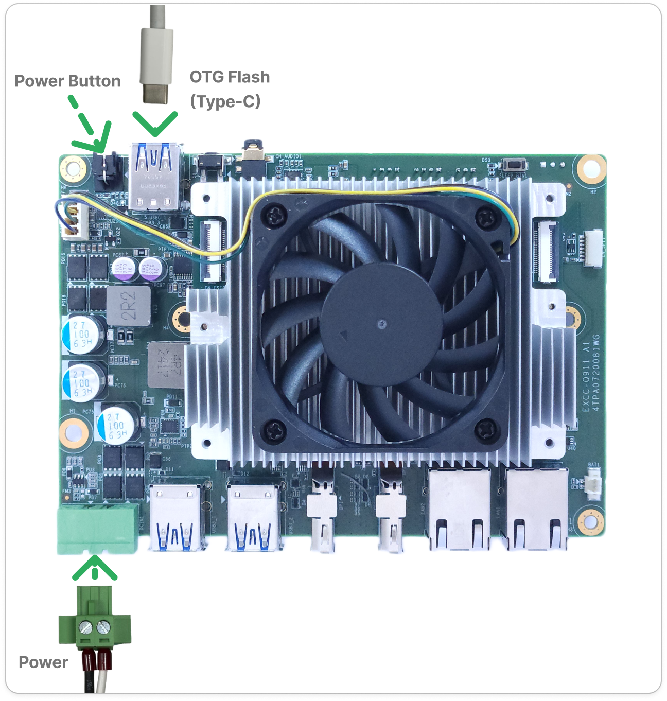
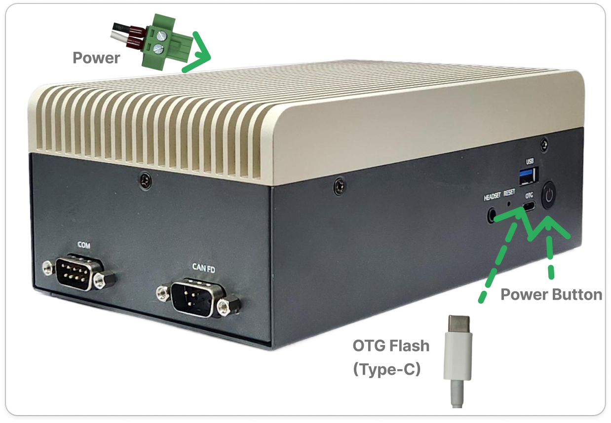
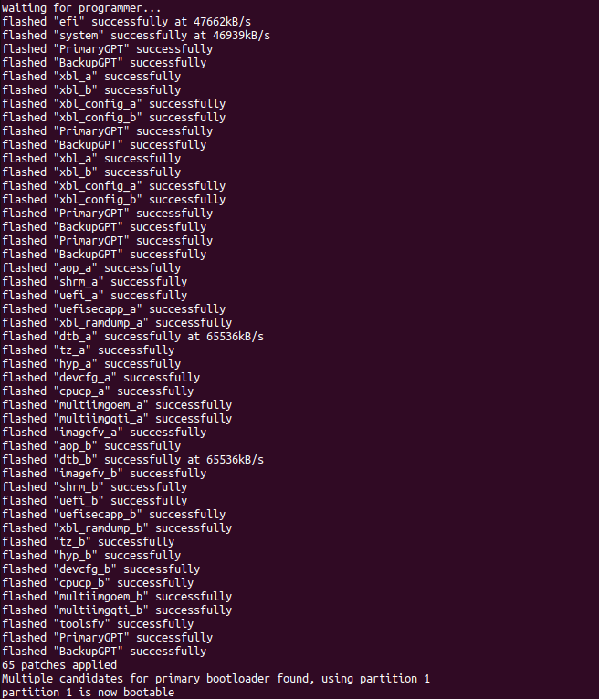

# Q911 Image Flashing Guide

This guide provides instructions for flashing or updating the system image on the Q911 platforms, including EXEC-Q911 and APEX-A100.

Use this guide when you need to re-flash the system image, switch OS, or recover a corrupted system. To update firmware or OS on a deployed device without re-flashing, see the [Qualcomm OTA Guide](../ota/README.md) instead.

To obtain an image package, please contact Innodisk sales. We mainly provide Yocto Linux images, built from [meta-iQ__manifest](https://github.com/InnoIPA/meta-iQ__manifest). If you want to run Ubuntu and keep all IO functions working correctly, please contact Innodisk sales to obtain a validated Innodisk-ported image — see [iQ-ubuntu__manifest](https://github.com/InnoIPA/iQ-ubuntu__manifest) for the available versions.

> **Note**
> - Yocto Linux and Ubuntu images are flashed with exactly the same procedure below.
> - Boards ship with the initial provisioning (UFS provisioning / SAIL) already completed at the factory. You can flash the image directly — the one-time provisioning steps ([*Provision UFS*](https://docs.qualcomm.com/doc/80-70030-254/topic/flash_images.html#provision-ufs-one-time-prerequisite) / [*Flash SAIL*](https://docs.qualcomm.com/doc/80-70030-254/topic/flash_images.html#flash-sail-one-time-prerequisite)) described in Qualcomm's documentation are **not** needed.

This guide follows the official Qualcomm flashing procedure ([Qualcomm Linux Build Guide → Flash software images](https://docs.qualcomm.com/doc/80-70030-254/topic/flash_images.html)), adapted to the Q911 hardware. Each step below links to the corresponding section of that document.

<div align="center">
  
</div>

## Requirements

- **HW**: x86 PC as the host.
- **OS**: Ubuntu 20.04 or later (recommended). To flash from a Windows 11 host instead, see [Flashing from a Windows Host](./windows.md).
- **Cable**: USB Type-A to Type-C **data** cable (Type-A → host, Type-C → target). Required — flashing is not possible without it.
- **SW**: the `qdl` tool (see [Host Setup](#host-setup-one-time)).

## Host Setup (one-time)

You only need to do this section once. If your host is already set up, jump straight to [Step 1](#step-1-prepare-the-board-for-flashing).

**Install the `qdl` tool**

Flashing uses the [qdl](https://github.com/linux-msm/qdl) tool. Build it by following the [Build → Linux instructions in the qdl README](https://github.com/linux-msm/qdl#linux), which cover the required dependencies; prebuilt releases are also available on the same page.

> **Reference**: Qualcomm [Flash software images → *Flash the software → Using QDL*](https://docs.qualcomm.com/doc/80-70030-254/topic/flash_images.html#using-qdl)

**Set up udev rules**

Without this rule, running `qdl` as a regular user fails with a permission error.

Create `/etc/udev/rules.d/51-qcom-usb.rules` with the following content:

```text
SUBSYSTEMS=="usb", ATTRS{idVendor}=="05c6", ATTRS{idProduct}=="9008", MODE="0666", GROUP="plugdev"
```

Then restart udev and re-plug the USB cable if it is already connected:

```bash
sudo systemctl restart udev
```

> **Reference**: Qualcomm [Flash software images → *Update udev rules (one-time prerequisite)*](https://docs.qualcomm.com/doc/80-70030-254/topic/flash_images.html#update-udev-rules-one-time-prerequisite)

## Step 1: Prepare the Board for Flashing

Set the jumper on the bottom side of the board to `EDL mode`.

  <p align="center">
    
  </p>

Please also confirm that all boot mode DIP switches are set to `ON`, as shown below, so the system can boot from `UFS`. The DIP switches stay in this position for the entire flashing process — only the jumper changes.

  <p align="center">
    
  </p>

## Step 2: Connect the Target

Connect the USB cable between the host (Type-A end) and the port labeled `Flash / ADB` on the target device (Type-C end).

  <div align="center">
    <table>
      <tr>
        <td align="center"  width="50%" valign="bottom">
          
        </td>
        <td align="center"  width="50%" valign="bottom">
          
        </td>
      </tr>
      <tr>
        <td align="center">EXEC-Q911</td>
        <td align="center">APEX-A100</td>
      </tr>
    </table>
  </div>

> **Reference**: Qualcomm [Flash software images → *Force the device into EDL mode → Manual*](https://docs.qualcomm.com/doc/80-70030-254/topic/flash_images.html#manual) — connecting the Type-C cable to the host is part of the manual EDL entry procedure.

## Step 3: Power On and Verify EDL Mode

Connect the power supply and press the power button.

  <div align="center">
    <table>
      <tr>
        <td align="center"  width="50%" valign="bottom">
          
        </td>
        <td align="center"  width="50%" valign="bottom">
          
        </td>
      </tr>
      <tr>
        <td align="center">EXEC-Q911</td>
        <td align="center">APEX-A100</td>
      </tr>
    </table>
  </div>

Before flashing, confirm the device has entered EDL mode:

```bash
lsusb
```

You should see one device like this:

```text
Bus 002 Device 014: ID 05c6:9008 Qualcomm, Inc. Gobi Wireless Modem (QDL mode)
```

> `QDL mode` and `EDL mode` are the same thing — it is just a naming difference on Qualcomm's side.

If the device does not show up, see [Troubleshooting](#troubleshooting).

> **Reference**: Qualcomm [Flash software images → *Force the device into EDL mode*](https://docs.qualcomm.com/doc/80-70030-254/topic/flash_images.html#force-the-device-into-edl-mode) — the `lsusb` check for `05c6:9008` is the EDL verification step described there.

## Step 4: Flash the Image

1. Extract the image package provided by Innodisk on the host, and enter the folder.

    ```bash
    unzip image.zip
    cd image
    ```

    You will see files similar to the list below. Only part of the tree is shown here.

    ```text
    .
    ├── aop.mbn
    ├── cpucp.elf
    ├── devcfg_iot.mbn
    ├── dtb.bin
    ├── el2-dtb.bin
    ├── gpt_backup0.bin
    ├── gpt_backup1.bin
    ├── md5sum.txt
    .
    .
    .
    ```

2. Verify the package integrity with the bundled `md5sum.txt`. Every file should report `OK` before you continue.

    ```bash
    md5sum -c md5sum.txt
    ```

3. Flash the image. Run inside the image folder — the whole process takes a few minutes.

    ```bash
    qdl --storage ufs --include ./ \
      ./prog_firehose_ddr.elf ./rawprogram*.xml ./patch*.xml
    ```

If the flashing process completes successfully, you will see output similar to the following.

  <p align="center">
    
  </p>

> **Reference**: Qualcomm [Flash software images → *Flash the software → Using QDL*](https://docs.qualcomm.com/doc/80-70030-254/topic/flash_images.html#using-qdl) — same `qdl --storage ufs prog_firehose_ddr.elf rawprogram*.xml patch*.xml` command; the Innodisk package already bundles all required files, so no extra image-path setup is needed.

## Step 5: Switch Back to Normal Boot Mode

Power off the device and set the jumper on the bottom side of the board back to `Normal mode`. The DIP switches need no change — they stay `ON` the whole time.

  <p align="center">
    
  </p>

> **Reference**: Qualcomm [Flash software images → *Force the device into EDL mode → Manual*](https://docs.qualcomm.com/doc/80-70030-254/topic/flash_images.html#manual) — corresponds to Qualcomm's note to disable the EDL switch after flashing completes; on the Q911/A100 this means moving the jumper back to `Normal mode`.

## Step 6: Boot and Confirm

Connect a DisplayPort monitor, power on the device, and let it boot. Seeing the system desktop on the screen means the image was flashed successfully.

From here, head back to the [Q911 Quick Start Guide → Interact with the System](../q911/README.md#interact-with-the-system) to start using the device (DisplayPort, SSH, ADB, UART).

## Troubleshooting

**`lsusb` shows no `05c6:9008` device**

- Confirm the jumper is set to `EDL mode` (Step 1) and the device is powered on.
- Confirm the cable is connected to the `Flash / ADB` port and is a data-capable cable, not a charge-only one.
- Try another USB port on the host, then power-cycle the device.

**`qdl` fails with a permission error**

- The udev rule is missing or not loaded. Set it up as described in [Host Setup](#host-setup-one-time), restart udev, then unplug and re-plug the USB cable.

**Flashing fails midway or reports a Sahara protocol error**

- Unplug the power cable, plug it back in, and power on again — the board stays in EDL mode as long as the jumper is unchanged.
- Verify the device is detected again (Step 3), then re-run the flashing command.

## Reference

- [Qualcomm: Integrate and flash software (Dragonwing IQ-9075 EVK)](https://docs.qualcomm.com/doc/80-90441-252/topic/Integrate-and-flash-software.html?product=1601111740076074&facet=Ubuntu%20quickstart)
