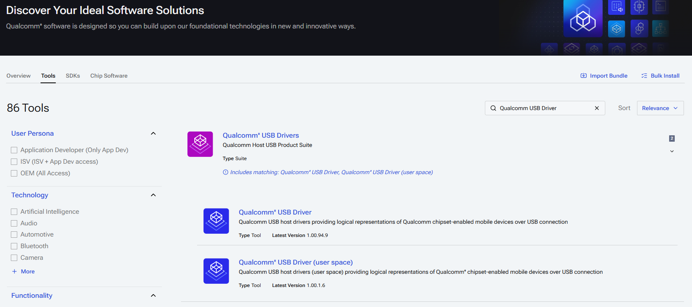

# Flashing from a Windows Host

This page covers the Windows-specific parts of the [Q911 Image Flashing Guide](./README.md). The board-side steps — EDL jumper, DIP switches, cabling, and power-on — are exactly the same, so follow the main guide for those and come back here for the host-side setup, the EDL check, and the flashing command.

We recommend an Ubuntu host for the smoothest experience, but flashing from Windows 11 with `qdl.exe` is verified to work on the Q911 platforms.

> Flashing with Qualcomm's xPCATApp GUI is also possible — we used it in our [hands-on workshop](https://innoipa.github.io/inno_qcom_hands_on_workshop/flashing.html) — but this guide does not cover it.

## Requirements

- **HW**: x86 PC as the host.
- **OS**: Windows 11.
- **Cable**: USB Type-A to Type-C **data** cable (Type-A → host, Type-C → target). Required — flashing is not possible without it.
- **SW**: the `qdl` tool and the Qualcomm USB Driver, QUD (see below).

## Host Setup (one-time)

**Install the `qdl` tool**

Build `qdl.exe` by following the [Build → Windows instructions in the qdl README](https://github.com/linux-msm/qdl#windows); prebuilt releases are also available on the same page.

**Install the Qualcomm USB Driver (QUD)**

Before flashing from the command line, install the Qualcomm USB Driver. Download it from the [Qualcomm Software Center](https://softwarecenter.qualcomm.com/) (a Qualcomm account is required to sign in): open the **Tools** tab and search for `Qualcomm USB Driver`.

<p align="center">
  
</p>

## Verify EDL Mode

After powering on the board in EDL mode ([main guide, Steps 1–3](./README.md#step-1-prepare-the-board-for-flashing)), open **Device Manager** and confirm the device appears as `Qualcomm HS-USB QDLoader 9008` under Ports.

If the device shows up with a warning icon or as an unknown device, the QUD driver is not installed — see [Host Setup](#host-setup-one-time) above.

## Flash the Image

1. Extract the image package provided by Innodisk and verify its integrity with the bundled `md5sum.txt`. Run the following in PowerShell inside the image folder — every file should report `OK` before you continue.

    ```powershell
    Get-Content md5sum.txt | ForEach-Object {
        $parts = $_ -split "\s+", 2
        $expected = $parts[0]
        $file = $parts[1].TrimStart("*")
        $actual = (Get-FileHash -Algorithm MD5 -Path $file).Hash
        if ($actual -eq $expected) { "OK: $file" } else { "FAILED: $file" }
    }
    ```

2. Flash the image. Run PowerShell from the folder containing `qdl.exe`, replacing `<IMAGE-FOLDER>` with the path to your extracted image folder. The whole process takes a few minutes.

    ```powershell
    .\qdl.exe --storage ufs `
      --include <IMAGE-FOLDER> `
      <IMAGE-FOLDER>\prog_firehose_ddr.elf `
      <IMAGE-FOLDER>\rawprogram0.xml `
      <IMAGE-FOLDER>\rawprogram1.xml `
      <IMAGE-FOLDER>\rawprogram2.xml `
      <IMAGE-FOLDER>\rawprogram3.xml `
      <IMAGE-FOLDER>\rawprogram4.xml `
      <IMAGE-FOLDER>\patch0.xml `
      <IMAGE-FOLDER>\patch1.xml `
      <IMAGE-FOLDER>\patch2.xml `
      <IMAGE-FOLDER>\patch3.xml `
      <IMAGE-FOLDER>\patch4.xml
    ```

    > PowerShell does not expand the `*` wildcard for `qdl`, so every `rawprogram` and `patch` file must be listed explicitly. List all of the `rawprogram*.xml` and `patch*.xml` files that your image package contains.

After flashing completes, continue with [Step 5 in the main guide](./README.md#step-5-switch-back-to-normal-boot-mode) to switch back to normal boot mode and boot the system.
