# Q911 Platform Quick Start Guide

## Overview
The Q911 family is built around the Qualcomm® IQ-9075 SoC. The product line currently has three versions. The table below provides an overview of their differences and the items included in each packing list.

| **Model** | **P/N** | **Description** | **Packing List** |
| --- | --- | --- | --- |
| EXMP-Q911 | EXMP-Q911-00A1-W1 | COM HPC Mini Module By Qualcomm IQ-9075 | 1x IQ9 COM-HPC Mini Module <br/> 1x Cooler with Fan (secured onto the module) |
| EXEC-Q911 | EXEC-Q911-00A1-W1 | COM HPC Mini EVK By Qualcomm IQ-9075| 1x IQ9 COM-HPC Mini Module <br/> 1x 3.5” COM-HPC Mini Carrier (secured with the module) <br/> 1x Cooler with Fan (secured onto the module) <br/> 1x 60W power adapter <br/> 1x US power cord <br/> 1x Speaker*2 cable <br/> 1x D-SUB(F) cable (GPIO) <br/> 1x D-SUB(M) cable (CAN FD) <br/> 1x USB 2.0 A-TYPE(F)*2 cable <br/> 1x D-SUB(M) cable (COM) |
| APEX-A100 | EXOC-Q911-00A1-W1 | Edge AI System By Qualcomm IQ-9075| 1x Fanless Edge AI System based on EXMP-Q911 module <br/> 1x 60W power adapter <br/> 1x US power cord |

This starting guide focuses on the EXEC-Q911 and APEX-A100 platforms, providing an overview of their hardware and helping users quickly get the system up and running.


## What’s in the Box

You can refer to the packing list above to see what is included in the Q911 family.

## EXEC-Q911 / APEX-A100 Hardware 

<div align="center">
  <table>
    <tr>
      <td align="center"  width="50%" valign="bottom">
        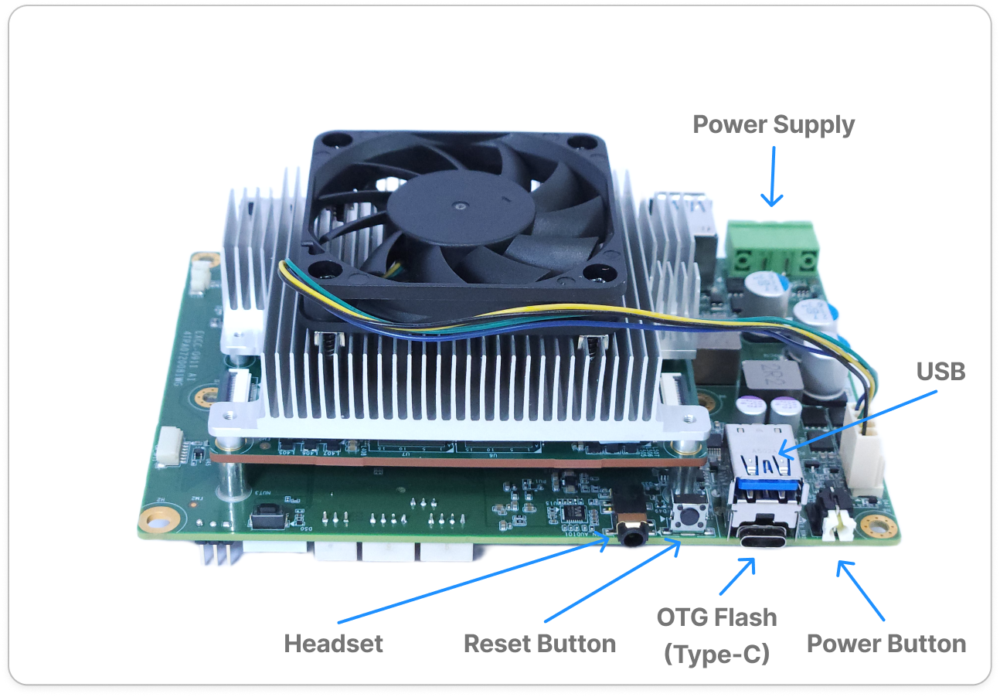
      </td>
      <td align="center"  width="50%" valign="bottom">
        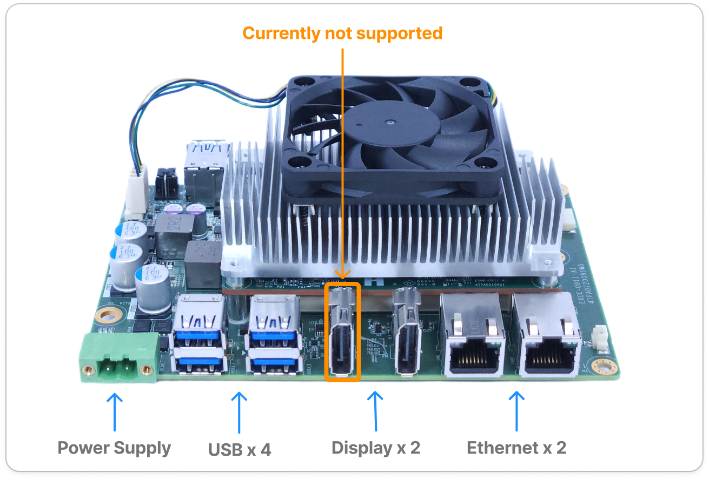
      </td>
    </tr>
    <tr>
      <td align="center">EXEC-Q911 Front</td>
      <td align="center">EXEC-Q911 Back</td>
    </tr>
  </table>
</div>


<div align="center">
  <table>
    <tr>
      <td align="center"  width="50%" valign="bottom">
        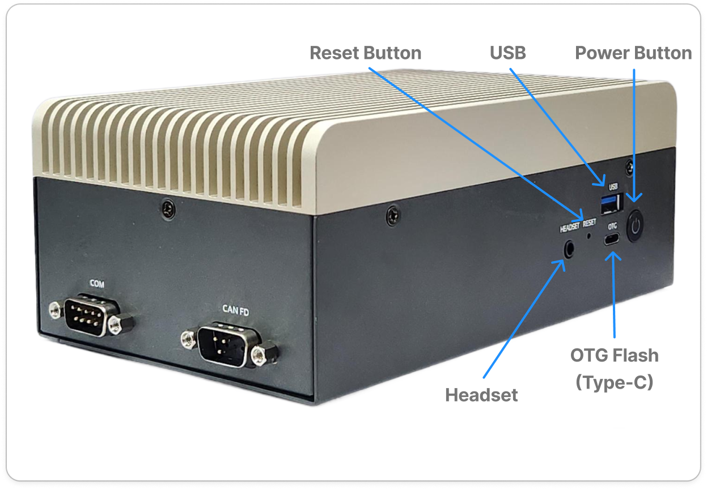
      </td>
      <td align="center"  width="50%" valign="bottom">
        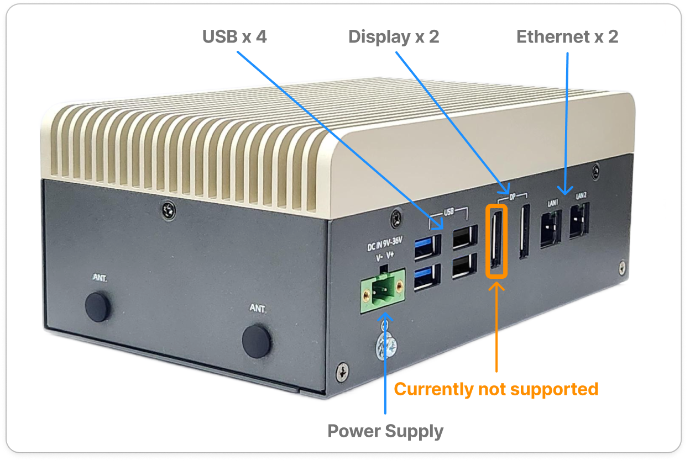
      </td>
    </tr>
    <tr>
      <td align="center">APEX-A100 Front</td>
      <td align="center">APEX-A100 Back</td>
    </tr>
  </table>
</div>


## Step 1: Prepare Required Items

Before you get started, please make sure you have the following items:

- DisplayPort (DP) monitor  
- USB keyboard & mouse  
- Ethernet cable 
- USB-to-TTL serial adapter  
- 60W power adapter

## Step 2: Power On

Please follow the steps below to boot the system.

1. Please ensure that the jumper on the bottom side of the board is set to `Normal mode`.
`EDL mode` should be used when flashing the system image.

   <p align="center">
    
  </p>

2. Connect the power supply and press the power button to boot the system.


  <div align="center">
    <table>
      <tr>
        <td align="center"  width="50%" valign="bottom">
          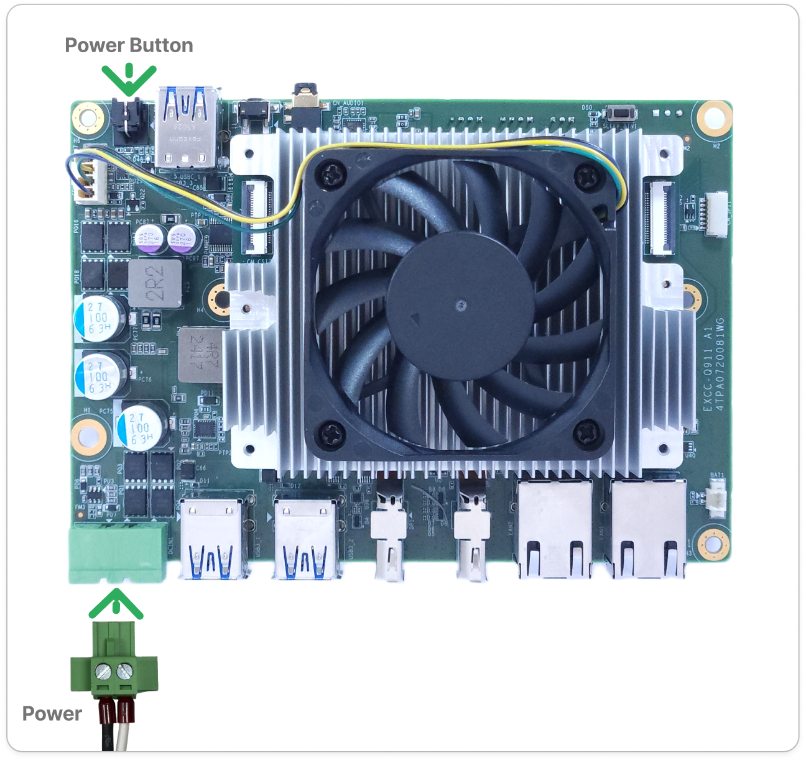
        </td>
        <td align="center"  width="50%" valign="bottom">
          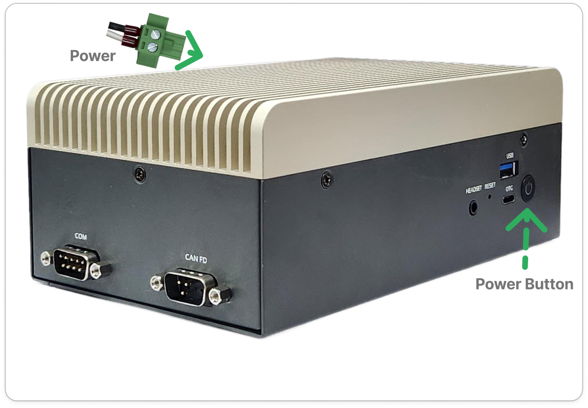
        </td>
      </tr>
      <tr>
        <td align="center">EXEC-Q911</td>
        <td align="center">APEX-A100</td>
      </tr>
    </table>
  </div>


## Step 3: Interact with the System

After the system boots, you can access the platform using one of the following methods:

- DisplayPort monitor

- SSH over Ethernet

- UART Debug Console

The device ships with either Yocto Linux or Ubuntu pre-flashed on the UFS storage, allowing you to boot and log in immediately.

Each operating system has different default login credentials:

- Yocto Linux

  ```bash
    Username: root
    Password: oelinux123
  ```
- Ubuntu (You will be asked to set a new password after logging in for the first time.)
  ```bash
    Username: ubuntu
    Password: ubuntu
  ```
  > 💡 **Tip:** For Ubuntu, the network configuration will not be enabled until the iq-ubuntu.deb package is installed. Please follow the steps below to complete the installation: 
  > 1. Use a USB storage device to copy the [iq-ubuntu.deb](./iq-ubuntu.deb) to the system. 
  > 2. Install the package using the command: `sudo apt install </path/to/iq-ubuntu.deb>`
  > 3. Reboot the system. Network functionality will be available after the restart.


### Interact with the System Using a DP Display

If you are accessing the system using a DP display, please follow the steps below to set it up.

1. Connect the DP display and USB keyboard/mouse. Then, connect the power cable and press the power button to boot the system.

  <div align="center">
  <table>
    <tr>
      <td align="center"  width="50%" valign="bottom">
        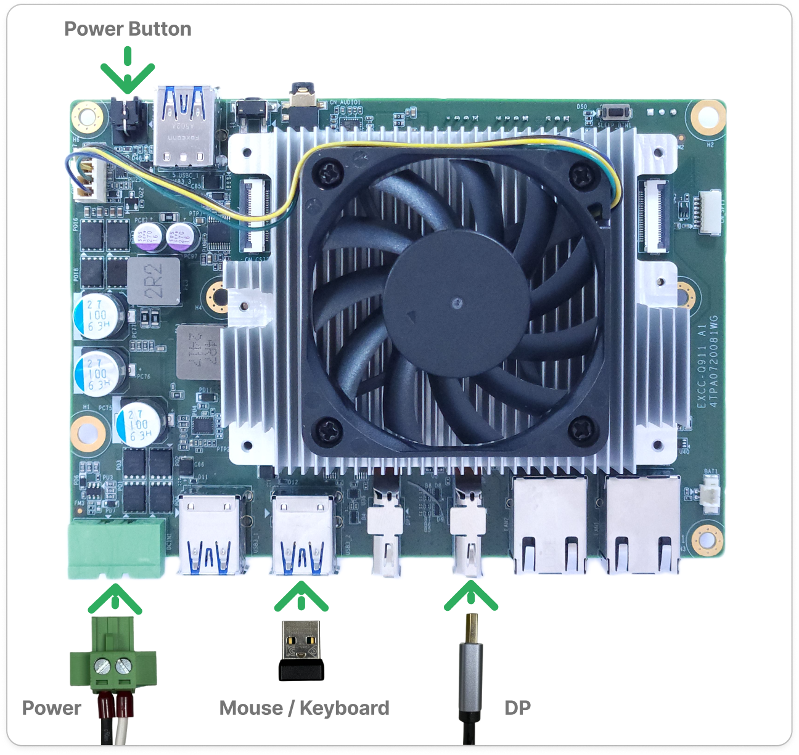
      </td>
      <td align="center"  width="50%" valign="bottom">
        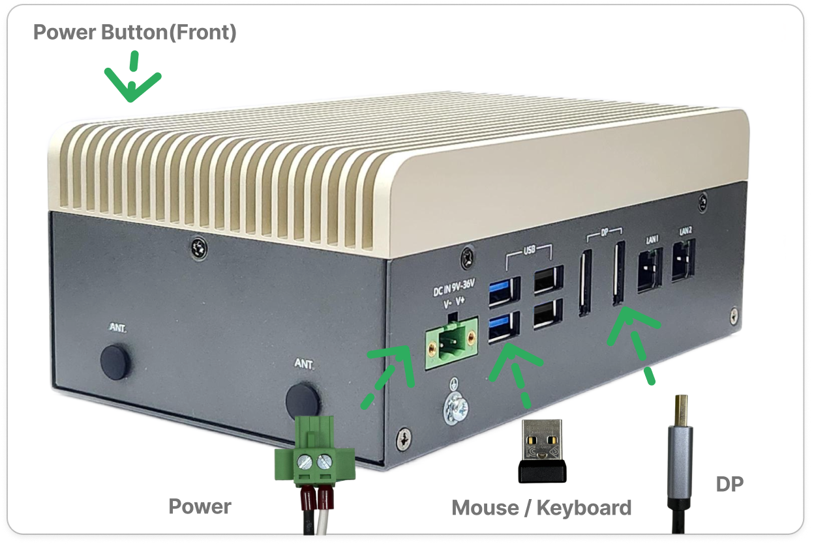
      </td>
    </tr>
    <tr>
      <td align="center">EXEC-Q911</td>
      <td align="center">APEX-A100</td>
    </tr>
  </table>
  </div>


2. After the device boots up, you should see the output displayed on the DisplayPort (DP) monitor.
  
  - In Yocto Linux, you can click the icon in the upper-left corner to open the terminal. 

     <p align="center">
      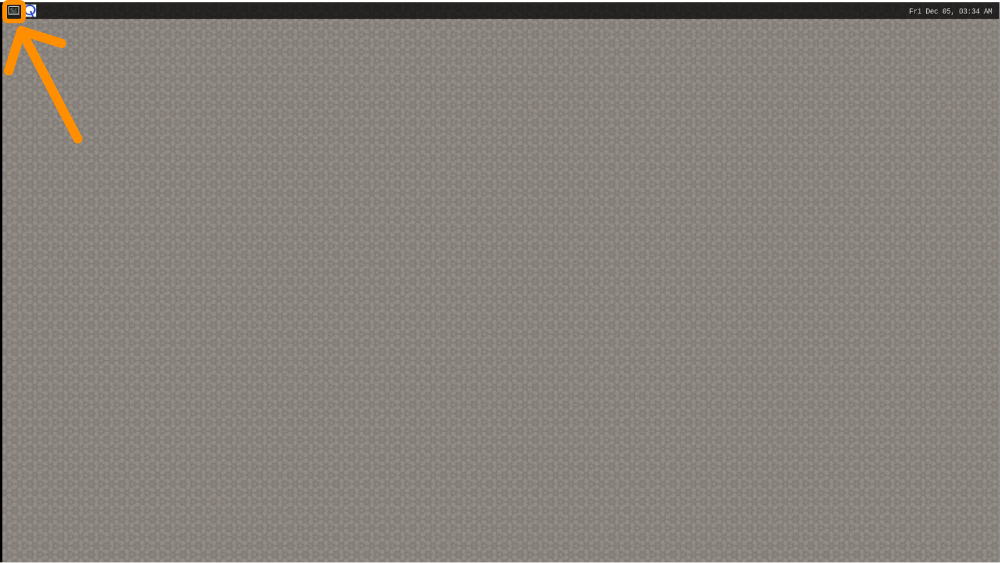
    </p>

     <p align="center">
      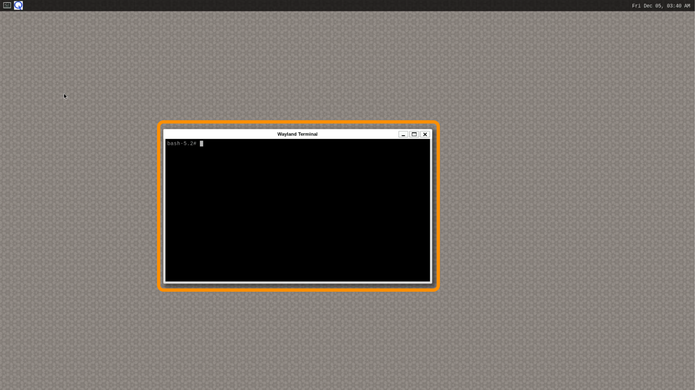
    </p>

  - In Ubuntu, you can interact with the system just as you would on a standard amd64 Ubuntu installation.
    
     <p align="center">
      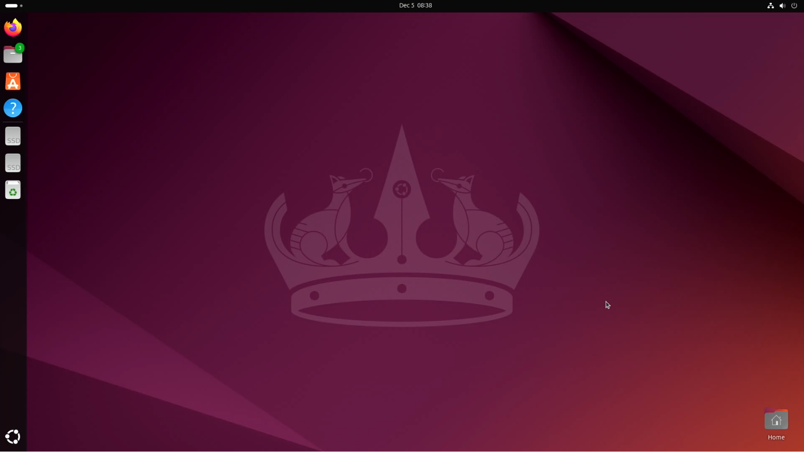
    </p>


### Interact with the System Using SSH over Ethernet

If you are accessing the system using SSH to intract with system, please follow the steps below to set it up.

1. Please connect an Ethernet cable and ensure that the device is reachable over the network. Then, connect the power cable and press the power button to boot the system.

<div align="center">
  <table>
    <tr>
      <td align="center"  width="50%" valign="bottom">
        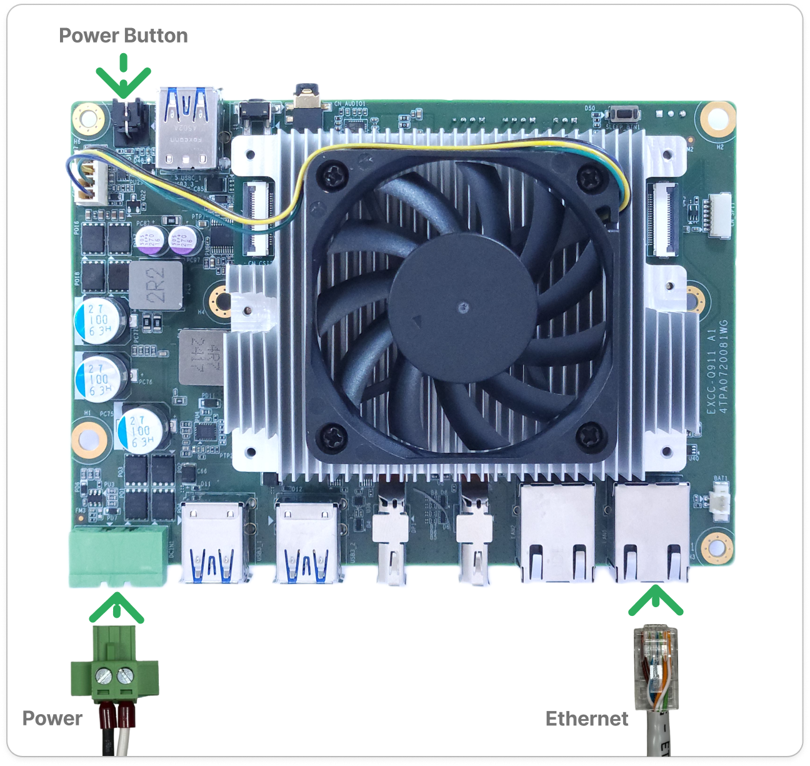
      </td>
      <td align="center"  width="50%" valign="bottom">
        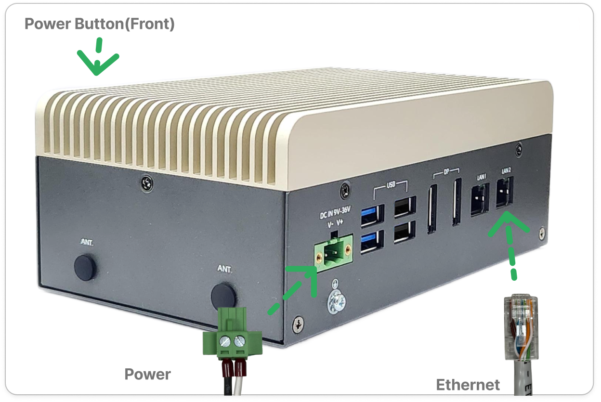
      </td>
    </tr>
    <tr>
      <td align="center">EXEC-Q911</td>
      <td align="center">APEX-A100</td>
    </tr>
  </table>
</div>

2. After the device boots up, You can access the device via SSH from any machine on the same network.
  
  - Use the following command to connect the Yocto Linux

    ```bash
    $ ssh root@<target device ip address>
    ```

     <p align="center">
      
    </p>

  - Use the following command to connect the ubuntu

    ```bash
    $ ssh ubuntu@<target device ip address>
    ```
     <p align="center">
      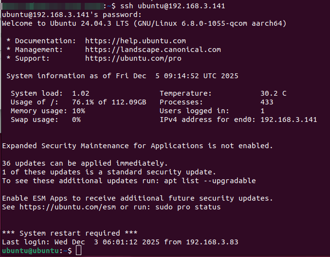
    </p>

### Interact with the System Using UART Debug Console

If you are accessing the system using UART debug console to interact with the system, please follow the steps below to set it up.

> 💡 **Tip:** You can refer to the [Qualcomm guide on setting up a debug UART](https://docs.qualcomm.com/doc/80-70014-253/topic/ubuntu_host.html#set-up-debug-uart) for detailed instructions on how to connect using minicom.

1. Please connect the USB-to-TTL serial adapter to the UART pins on the bottom side of the board. Then, connect the power cable and press the power button to boot the system. 
  

  <p align="center">
    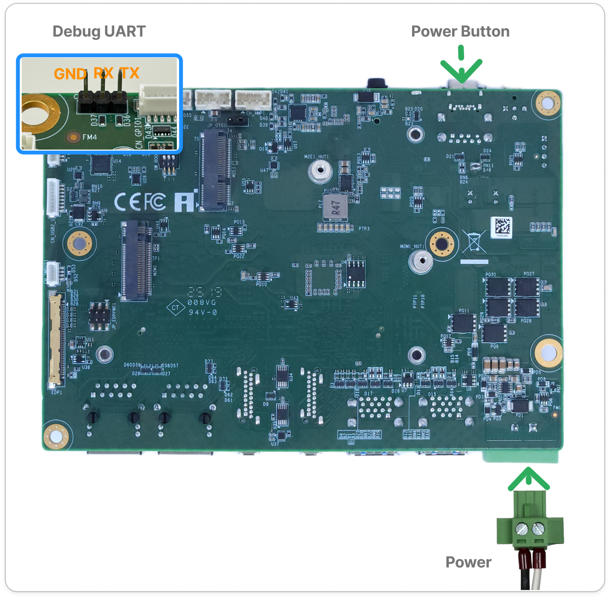
  </p>

  > 💡 **Tip:** Set your serial terminal to 115200 baud, 8 data bits, no parity, 1 stop bit, no flow control

2. After the device boots up, you will see a screen similar to the one shown below.

  <p align="center">
    
  </p>

## Next Steps

Depending on your needs:

- [iQ-Studio](../../../README.md#application): It helps users quickly understand, explore, and prototype ideas by showcasing the platform’s performance and capabilities—inspiring innovation through hands-on experience.

- [Application](../../applications/) — Reference ready-to-run demos illustrating how to build applications on the platform.

- [SDK](../../sdks/)  — Learn how to develop and integrate your own solutions with the platform SDK.

- [AVL(Approved Vendor List)](../../avl/) — Provides guidance on verifying that the driver starts correctly on the system and quickly demonstrating the validated results.

- [Benchmark](../../../benchmarks/) — Review performance metrics for AI and system workloads.