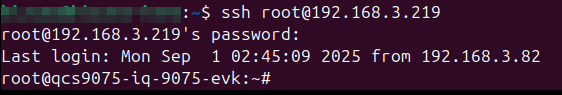

# Q911 Quick Starting Guide

- [Q911 Quick Starting Guide](#q911-quick-starting-guide)
- [Overview](#overview)
- [What's in the box](#whats-in-the-box)
- [Hardware](#hardware)
- [Boot up Q911](#boot-up-q911)
- [Connect to Q911](#connect-to-q911)
  - [DP Display](#dp-display)
  - [SSH](#ssh)
  - [Debug UART](#debug-uart)
- [Next Steps](#next-steps)


# Overview

The Q911 product line offers three versions based on the Qualcomm IQ-9075 CPU.

- The EXMP-Q911 is a 3.5" COM-HPC Mini SOM designed for flexible integration.

- The EXCC-Q911 combines the SOM with a dedicated carrier board, providing a ready-to-use development platform. 

- The EXOC-Q911 is a complete system solution that integrates the SOM, carrier board, and an optimized thermal housing. Please refer to the table below for more details.

| **Model** | **P/N** | **Description** | **Packing List** |
| --- | --- | --- | --- |
| EXMP-Q911 |  | 3.5” COM-HPC mini SOM board |  |
| EXCC-Q911 |  | Carrier board |  |
| EXOC-Q911 |  | 3.5” COM-HPC mini SOM board <br>+ Carrier board <br>+ Housing |  |

# What's in the box

The package contains the following three items:

- Q911 Platform
- 60W Power Adapter
- US Power Cord


<div align="center"></div>


# Hardware

<div align="center">
  <table style="border: none; border-collapse: collapse;">
    <tr>
      <td align="center" style="border: none;">
        
        <br>
        <em>Q911 - Front</em>
      </td>
      <td align="center" style="border: none;">
        
        <br>
        <em>Q911 - Back</em>
      </td>
    </tr>
  </table>
</div>


- Debug UART

    Prepare a USB to TTL serial converter/adapter that supports the UART protocol.


- A Power Supply 

   `60W` Power Adapter + US Power Cord

# Boot up Q911

The Q911 platform ships with the system image pre-loaded on the UFS storage. To get started, simply connect the power supply and press the power button.

<div align="center">
  <table style="border: none; border-collapse: collapse;">
    <tr>
      <td align="center" style="border: none;">
        
        <br>
        <em>Boot up Q911</em>
      </td>
      <td align="center" style="border: none;">
        
        <br>
        <em>Check EDL Switch Mode</em>
      </td>
    </tr>
  </table>
</div>

>**Important**: If the network isn’t accessible after booting, you can fix it by plugging in the cable before starting up..

1.  Connect the power cable.

  
2.  Ensure the EDL Switch is in `Normal Mode`. If the switch is set to EDL Mode, the device will be unable to boot into the operating system.
  

3.  Press the power button.


# Connect to Q911

You can connect to the Q911 platform in one of the following three ways:

- DP Display

- SSH

- Debug UART

> Important: Ensure that all peripheral devices are connected before connecting the power supply.

```shell
# For login 
Username: root
Password: oelinux123
```

 

## DP Display


1.  You can operate the Q911 platform directly by connecting a DisplayPort (DP) monitor along with a USB keyboard and mouse.


<div align="center"></div>


2.  After the device boots up, you should see a display on the DisplayPort (DP) monitor.


<div align="center"></div>


3.  Click the icon in the top-left corner of the screen to open a terminal window.


<div align="center"></div>


4.  You should now see the terminal window on the screen.
  

<div align="center"></div>


## SSH

1. Connect the Q911 device to your Local Area Network (LAN) using an Ethernet 
cable


<div align="center"></div>


2. From another computer on the Local Area Network, establish an SSH connection to the Q911 to communicate with it.


3.  After the Q911 has booted up, enter the SSH command.

    ```bash 
    $ ssh root@<Q911 DEVICE IP-ADDR>
    ```

4.  Upon successful login, you will see the command prompt appear in your terminal.


<div align="center"></div>


## Debug UART

You can use a USB to TTL serial adapter to connect to the Q911's UART interface. This provides direct access to the Debug Console for communication.


<div align="center"></div>


1.  Connect the power supply, and the Debug UART.

2.  Press the power button.

3.  You can refer to the [Qualcomm guide on setting up a debug UART](https://docs.qualcomm.com/bundle/publicresource/topics/80-70014-253/ubuntu_host.html#set-up-debug-uart) for instructions on how to connect using `minicom`.

4.  The following screen should appear:


<div align="center"></div>


# Next Steps

To get started with some examples, follow the link below to access resources and guides for running various demonstrations on your Q911.

- [iQ-Studio](/README.md): It helps users quickly understand, explore, and prototype ideas by showcasing the platform’s performance and capabilities—inspiring innovation through hands-on experience.